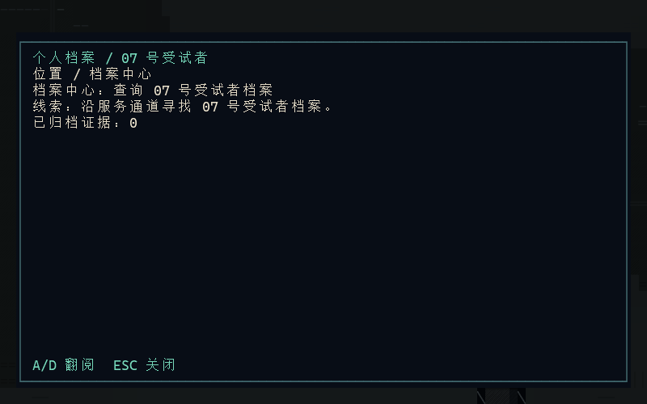
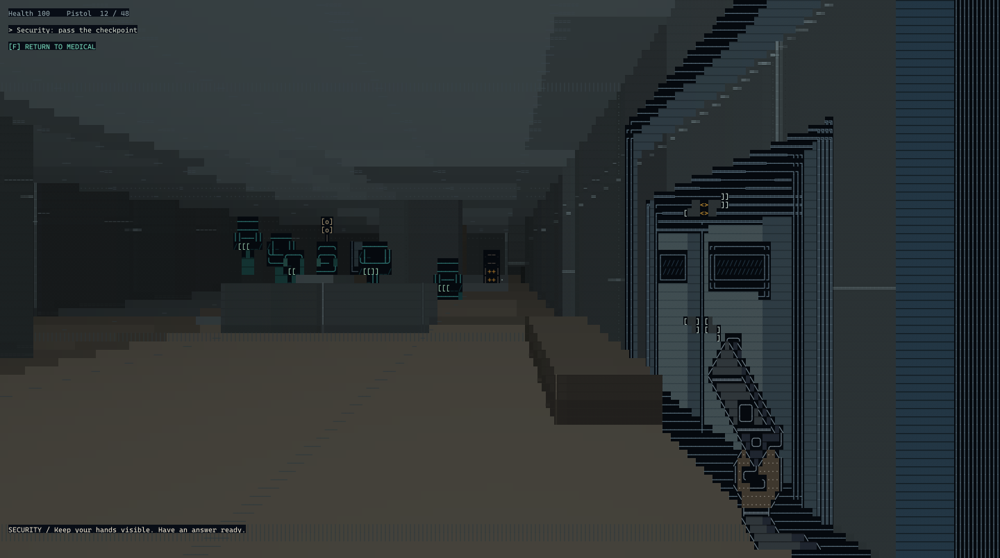
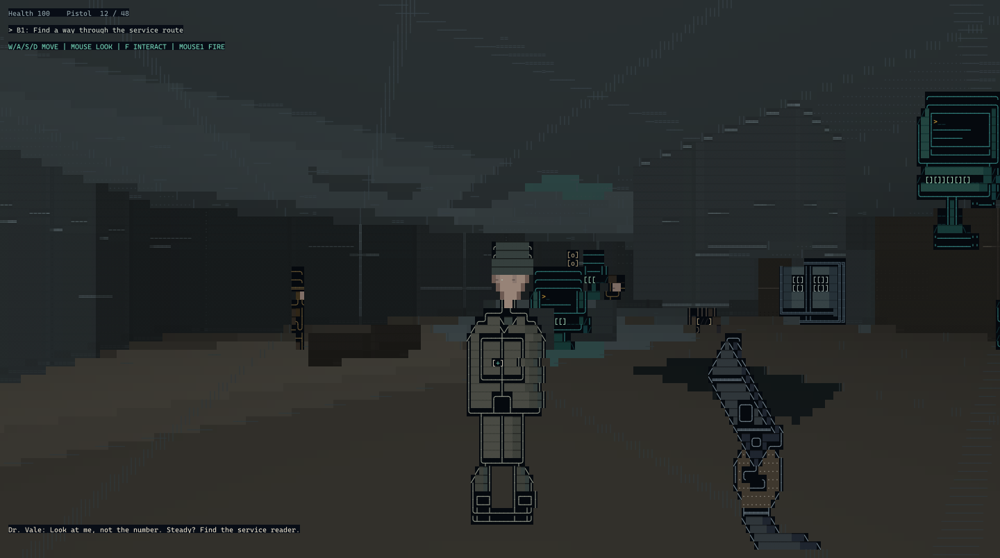
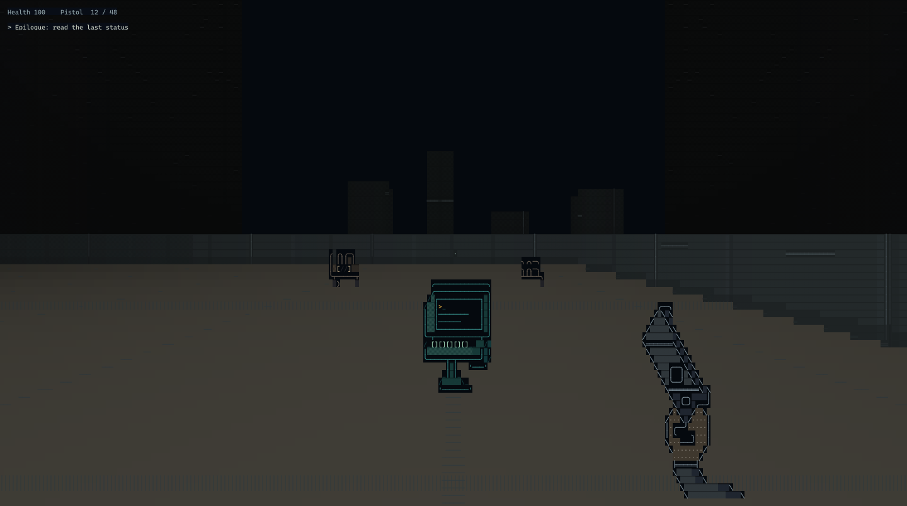

# WRITEOVER-07

[简体中文](README.zh-CN.md) · [Download the playtest](https://github.com/Rainflowers686/WRITEOVER-07/releases/latest)

A first-person immersive sim built out of characters. You wake up in the basement level of a facility with a number, a weapon and a file that cannot agree on who you are.

Read why a door refused you, dig through the records, talk to whoever is on shift, open the next checkpoint with a credential or a terminal, or shoot your way through. A room keeps what you did in it. Cameras, a body somebody finds, a raised alert level and the people who remember it decide how the next door opens.

*Rendered from the game's own character cells. Font, text size and window size change how it looks in a real terminal.*

A Windows x64 playtest build is out, with Simplified Chinese and English included. [Download the latest playtest](https://github.com/Rainflowers686/WRITEOVER-07/releases/latest) · [Player guide](docs/release/PLAYER_GUIDE.en.md)

## What is different here

- **The facility is made of characters.** Door frames, consoles, body armour, faces and the weapon in your hands are hand-authored character assets. Colour separates materials, and figures have front, back and side silhouettes.
- **Read the room before you decide to shoot.** A reader tells you why it refused you, a terminal keeps a record, and the person on duty knows something you do not.
- **Everyone here has a job.** Security patrols. A cleaner deals with what is left behind. Maintenance technicians know the wiring and the bypasses. Medical looks at the person before the number.
- **The narrator has its own account.** It files your actions in the facility's language, its tone shifts, and its version of events is worth checking against the room, the records and the people.
- **There is more than one way through.** Credentials, cooperation, terminals, maintenance bypasses, a quiet route, or force.
- **Three endings turn on what you leave behind.** The evidence you collect and the way you work decide what you can choose at the end.

## You wake up in B1

Medical staff check whether you can stand. A reader checks your credential. Security waits for an answer that fits the procedure. Nobody is in a hurry to explain why you are here.

From the revival area you work upward through Calibration, Medical and Security, then into Records and Dispatch. The questions change on the way. A file can open the next door without explaining what happened. Some staff will help you. Others would rather finish their shift.

The campaign runs to the roof. How you get there, and what you can do once you arrive, follows from what you found and what you left behind.

## Read the room first

The first-person view handles space. Where the door is, which guard is facing you, where to take cover when a fight starts. Text handles how the place works: what the equipment says, what a record logged, why the person in front of you will not step aside.

Walk into a room and you can check the equipment, read the notices and talk to the staff before you draw. The Case File collects your current objective, the leads you have, the records you acquired and your access status. If you miss a line, the recent-event and dialogue history keeps it.

Controls are real-time keyboard and mouse. There is no command language to memorise. This is a single-player offline game, not a multiplayer MUD.

*Objectives, leads, acquired records and access status in the Case File. The interface ships in both languages, and this capture shows the Chinese build.*

## The building remembers what you did

Cameras cover specific areas and can be taken out of the picture. A person left unconscious and a person left dead are two different scenes to walk away from. Once somebody finds a body, the problem stops being about you and one guard.

The game records these as events. Who saw it, who heard about it, how far the alert level rose, who formed a memory of it. Those follow you out of the room. What you did in B1 can decide which department knows your face later, or make a checkpoint behave differently than it did the first time.

The cleaner is worth watching. How you treated him and what you left in the corridor change whether he covers for you, calls Medical, or reports it to Security.

## The people here have shifts to finish

The campaign has 17 NPCs across 6 factions and 7 roles: security, cleaning, maintenance, medical, research, records and dispatch, and administration. Some walk a patrol route. Others stay at their post.

They work from sight and sound. A patrolling guard reacts to a noise, walks over to look, and moves into a combat rhythm when the threat escalates. Their memory is limited, but it is used in how they respond later. The same event means different things to a guard, a technician and a doctor.

Dialogue is authored, and behaviour is driven by game state. The project's engineering constitution rules out runtime language models and network code, so nobody here is a chatbot.

## The narrator is not neutral

> NARRATOR / Records does not ask who you are. It asks which version will survive.

It speaks the facility's language: permission, procedure, registration, filing. It turns your actions into an account it is willing to keep, and it offers its own kind of advice. Now and then its version does not match what you just saw.

Every line is authored text triggered by the situation and delivered as text. There is no voice acting in this build and no model writing lines while you play. It is worth reading the narrator against the records, the room and what people tell you.

## More than one way through

Credentials, cooperation from staff, terminal work and maintenance bypasses open particular doors. Moving quietly, making noise and changing a scene all draw different responses in different places. You can also choose force and then live with the room you created.

Three weapon slots are available: pistol, SMG and stunner. The stunner leaves people alive and leaves a scene for someone else to find.

The three endings are not laid out at the start. The evidence you gather and the way you travel affect what you can choose at the end.

## The whole facility is made of characters

Up close, the door frames, consoles, body armour, faces and weapons are all characters. People and weapons use hand-authored character assets, with colour separating materials and different silhouettes for facing. The renderer aims for a first-person space you can read while the characters stay visible as characters.

The renderer outputs character cells directly. Colour and shading come from the palette, and depth decides which glyph gets used.

## At a glance

- 19 playable rooms, 32 scene transitions, 3 endings
- 17 NPCs across 7 roles and 6 factions
- Case File with objectives, recent events and dialogue history
- Manual saves, chapter checkpoints and continue
- Simplified Chinese and English, switchable in-game
- Contrast, reduced shake and flicker, text duration, separate volume channels, frame-rate cap
- Pistol, SMG and stunner weapon slots

The facility directory lists 41 floors as part of the setting. Nineteen of those rooms can be entered, running from B1 to the roof.

## Download and play

The current playtest is on the [Releases page](https://github.com/Rainflowers686/WRITEOVER-07/releases/latest), under the `v0.2.0-course` tag.

1. In Assets, download `WRITEOVER-07-v0.2.0-candidate.1-win-x64.zip`. Do not take Source code.
2. Extract it fully, keep the `data` folder next to the executable, and run `WRITEOVER-07.exe`.
3. Pick Simplified Chinese or English at first launch, then start a new game. If a recovery save exists, Continue appears.

Platform: 64-bit Windows. The package is unsigned. Check where you downloaded it and verify it against the bundled `SHA256SUMS.txt`.

Version and provenance

- The source `PRODUCT_VERSION` is `0.2.0-candidate.1`.
- The latest release tag is `v0.2.0-course`. The `version.json` inside the package records the build commit, the `windows-x64` platform and the CI run. That build commit matches the delivery commit on `main`.
- The package name keeps the candidate prefix because the release pipeline generates tag, package name and internal version from one source.
- `main` may carry documentation or compatibility commits made after the public package. To reproduce the course submission, use the commit, source archive and checksums recorded in the delivery receipt.

## Controls

| Action | Windows default |
|---|---|
| Move / look | WASD / mouse |
| Interact / examine | F / right mouse button |
| Fire / reload | Left mouse button / R |
| Select weapon | 1 pistol, 2 SMG, 3 stunner |
| Case File | F1 |
| Save / load recovery save | F5 / F9 |
| Pause / back | Esc |

Keys can be rebound in settings. Conflicts are reported and must be confirmed before saving. The window needs at least 48×18 character cells. Below that the game pauses until you enlarge it.

## Language, saves and comfort

Simplified Chinese and English can be switched in settings. Field of view, mouse, text duration, perception detail, contrast, reduced shake and flicker, separate volume channels and a frame-rate cap are adjustable. Difficulty changes the damage you take and does not change evidence or access routes. The frame cap goes up to 120 to match the fixed simulation step. It is not a promise about measured display frame rate.

Manual saves, chapter checkpoints, the pre-final-choice save and the latest recovery file are separate. The pause menu can return you to a checkpoint or to the moment before the final decision. Starting a new game asks for confirmation and does not wipe every old slot at once. Back up saves you care about before changing versions.

## Before you play

The game contains firearms, lethal and non-lethal combat, unconscious and dead characters, moving and hiding bodies, and suspense set inside a closed institution.

Only Windows x64 is downloadable right now. Linux and macOS have build and automated checks, but no matching download, and those checks do not stand in for input or audio on those platforms. There is no full voice acting, no online AI and no multiplayer.

Automated tests do not cover how the game feels. First-session playtesting, audio impressions and completion time still need people.

## Feedback

Report problems in [Issues](https://github.com/Rainflowers686/WRITEOVER-07/issues) with the version, your system, the terminal, the room you were in and the steps to reproduce. If the problem was simply not knowing where to go, say what objective and hint you had at the time. Strip personal information out of screenshots and logs before posting.

## For developers

C++17, fixed-step simulation, DDA raycasting, a native character-cell renderer, event-driven systemic gameplay with stateful NPCs, data-driven facts and storylets, and transactional saves. CI builds and tests on Windows, Linux GCC/Clang and macOS ARM64.

[Development and building](docs/DEVELOPMENT.md) · [Course materials](docs/course/README.md) · [Version and provenance](docs/release/VERSIONING.md) · [Release notes](docs/release/RELEASE_NOTES_v0.2.0-candidate.1.md)

The repository has no open-source license. Public visibility does not grant redistribution or commercial use.