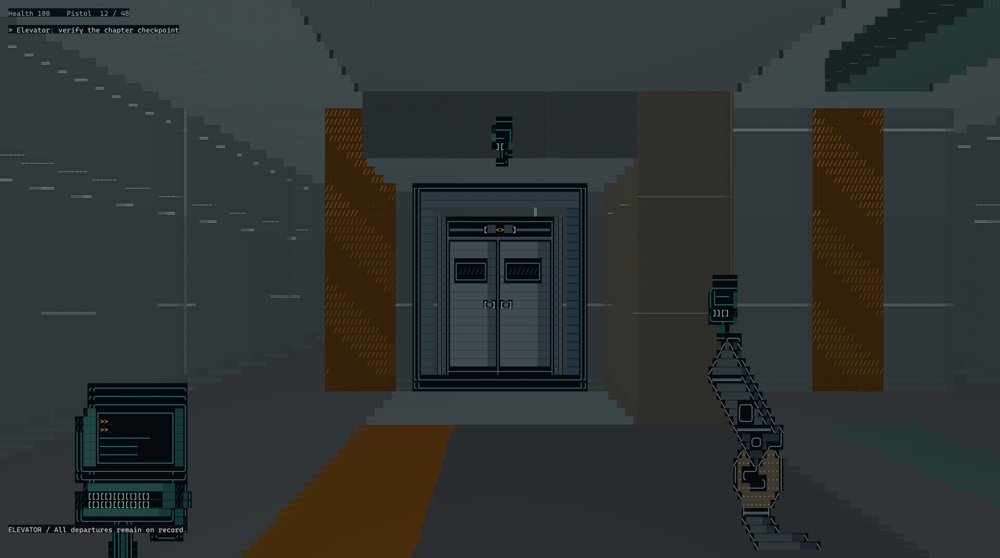

# WRITEOVER-07 · 重写协议：执行官07

**[简体中文](README.zh-CN.md) · [English](README.en.md)**

你在 B1 醒来。设施知道你的编号，却不急着解释你为什么在这里。
调查记录、与工作人员交谈，或用武力通过门禁——你留下的现场会跟着你向上走。

You wake in B1. The facility knows your number, but offers no reason for your
presence. Read its records, talk to its staff, or force your way through.
What you leave behind can change what waits upstairs.

*实际游戏字符单元导出的预览，不是原生终端截图。字体和窗口会影响观感。
Preview exported from production character cells, not a native terminal screenshot.*

[试玩下载 / Downloads](https://github.com/Rainflowers686/WRITEOVER-07/releases) ·
[中文指南](docs/release/PLAYER_GUIDE.zh-CN.md) ·
[English guide](docs/release/PLAYER_GUIDE.en.md) ·
[本版说明 / What's changed](docs/release/RELEASE_NOTES_v0.2.0-candidate.1.md) ·
[问题反馈 / Issues](https://github.com/Rainflowers686/WRITEOVER-07/issues)

当前源码候选版 / Current source candidate: `0.2.0-candidate.1`.
下载状态以发布页的实际附件为准。候选版不代表真人验收完成。
Check the release assets for download availability. Candidate status does not
mean human acceptance is complete.

19 个可玩房间，B1 至屋顶，三种结局。世界、人物和武器由手工设计的字符构成。
19 playable rooms, B1 to the roof, three endings. The world, people and weapons
are built from authored character art.

想看实现？/ Looking for the implementation?
[Development](docs/DEVELOPMENT.md) ·
[Validation strategy](docs/engineering/TEST_STRATEGY.md) ·
[Version and provenance](docs/release/VERSIONING.md)
