# Opus 5 第四轮红队：PRODUCTION EXECUTION PLAN

> 输出时间：2026-09-02 16:34 CST  
> 输入基线：P0-v1.0 FINAL CANDIDATE（04_P0-v1.0_FINAL_CANDIDATE.md）  
> 前序裁决：第三轮 FREEZE = YES，无未解决 Fatal  
> 本轮角色：Executive Producer / Technical Producer / Release Manager / Course-delivery Strategist

---

## A. FINAL PRODUCTION VERDICT

```
PRODUCTION_VERDICT              = GO
OPEN_FATAL                      = N (0)
OPEN_MAJOR                      = N (0)
PRODUCTION_FREEZE_RECOMMENDED   = YES
NEXT_STEP                       = FABLE_ENGINEERING_FOUNDATION
```

**裁决理由**：P0-v1.0 范围已冻结，三轮红队已清除全部 Fatal 和 Major。本计划将 16 天工期拆解为可执行、可降级、可验收的日级任务。若无新 Fatal 发现，**本计划即作为最终生产执行指令，不再开启第五轮规划红队。**

---

## B. EXECUTIVE SUMMARY

### 项目最可能拿第一的原因

1. **辨识度碾压**：全班唯一在 Windows 终端中运行真实高刷新字符 3D FPS 的团队。
2. **三支柱可信**：爽快射击 + 不可靠旁白 + 因果回调，即使课程作业中也是正式游戏设计，不是"凑功能"。
3. **完成度可证明**：F3 开发者面板实时展示 Sim/Render/Present/Event/NPC 状态，评审老师可直接验证系统真实运行。
4. **他组试玩印象深刻**：陌生人双击 exe 即玩，30 秒内开枪，无需网络、无需安装、无需说明。
5. **报告素材丰富**：6 模块天然对应 6 人分工，每模块有一张 UML、一个 STL 用法、一个设计模式、一个 debug 面板，文档不会空洞。

### 现在最可能失败的 5 个原因

| # | 风险 | 触发条件 | 后果 |
|---|------|----------|------|
| 1 | 终端吞吐达不到 120Hz 提交 | R0 实测失败 | 120Hz 承诺无法兑现，第一支柱削弱 |
| 2 | Height/Span Raycaster 碰撞边界错误 | 玩家可穿墙/卡墙/掉出地图 | 游戏不可玩，必须换方案 |
| 3 | 6 个 AI Agent 各自编译通过但集成后全线崩溃 | 无统一 contract 验收 | 9/11 无法通关 |
| 4 | 内容生产瓶颈：6 个 Room 的 Storylet/Fact/VO 写不完 | 9/10 内容冻结未达标 | 后半程空洞，因果回调不可见 |
| 5 | 报告/文档与代码脱节 | 9/15 发现报告仍为空白 | 暑期课程报告 40% 权重丢失 |

### 从今天开始最重要的 5 个动作

1. **立即创建 GitHub 私有仓库并 push 初始骨架**（今天 17:00 前）—— 利用查重豁免条款，建立 git 历史。
2. **R0 拆为 8 个独立验证，9/3 22:00 必须全部完成** —— 不等"完整原型"，用最短验证驱动技术决策。
3. **9/3 晚冻结公共接口和数据 schema** —— 提前写 Fable 工程地基产出，确保 9/4 六路并行前提。
4. **9/4 提交真实 WBS/UML/Use-Case/OOA 分工材料** —— 上课前完成，作为课程设计要求节点交付物。
5. **M4（World/Map/Puzzle）今天起用假数据先跑管线** —— 不依赖 M1/M2/M3 完成，Room 模板和 Storylet 数据可独立编写和校验。

### 三件事绝不再做

1. **绝不再讨论"FPS 是否属于 MUD"** —— 教师已明确许可。
2. **绝不再新增玩法大类**（商店、自由对话、第四结局、网络）—— P0 范围已冻结。
3. **绝不再换渲染范式**（Sector/Portal、BSP、三角网格）—— Height/Span Raycaster 是最终方案。

---

## C. FINAL WBS

所有 WBS 任务均 ≤2 天生效，Owner 用字母代号（A–F），详见第 G 节六人分工。

### P0 Product

| WBS ID | 名称 | Owner | Start | Finish | Person-Hours | 依赖 | 输入 | 输出 | 验收证据 | DoD | Fallback |
|--------|------|-------|-------|--------|-------------|------|------|------|---------|-----|----------|
| P0.01 | 最终产品定义冻结 | A | 9/2 16:34 | 9/2 18:00 | 1.5 | 无 | 前三轮输入 | P0-v1.0 冻结确认 | 本文件 A 节 | 无新 Fatal 即冻结 | 无 |
| P0.02 | 课程范围确认 | A | 9/2 18:00 | 9/2 19:00 | 1 | 无 | 课程大纲 | 课程要求追踪表 | 逐项对照大纲 | 所有课程要求有对应实现项 | 9/4 课上修正 |

### R0 Feasibility Spikes

| WBS ID | 名称 | Owner | Start | Finish | Person-Hours | 依赖 | 输入 | 输出 | 验收证据 | DoD | Fallback |
|--------|------|-------|-------|--------|-------------|------|------|------|---------|-----|----------|
| R0.01 | Terminal Throughput Spike | B | 9/2 19:00 | 9/3 12:00 | 6 | P0.01 | ANSI/Win32 API | 吞吐基准报告 | 实测 240×67 ≥120 提交/秒 | Buffer 填充/提交循环无闪烁 | 降为 HIGH_REFRESH 预设 192×54 |
| R0.02 | Height/Span Visibility | B | 9/2 19:00 | 9/3 12:00 | 6 | P0.01 | Raycaster 概念 | 射线/span 验证 | 低墙/沟槽/高台/低天花全部正确 | 6 种场景截图 | 若失败：简化射线为单射线，放弃多 span |
| R0.03 | Controller/Collision | C | 9/2 19:00 | 9/3 16:00 | 8 | P0.01 | 姿态参数表 | 碰撞+姿态验证 | 5 种姿态无穿透/卡墙 | 4 角测试盒通关 | 删除 Prone/Mantle，保留 Stand/Crouch/Jump/Lean |
| R0.04 | Mouse/Input | C | 9/3 09:00 | 9/3 16:00 | 4 | R0.03 | Raw Input API | 输入三层 fallback | Alt+Tab/IME/失焦全部通过 | 测试矩阵 8 项全绿 | 纯键盘 fallback |
| R0.05 | Weapon Feedback | C | 9/3 14:00 | 9/3 18:00 | 4 | R0.04 | hitscan 概念 | 武器原型 | 开枪→命中→反馈 < 1 帧 | 7 米靶命中检测 | 先做纯视觉反馈 |
| R0.06 | Event→NPC→Narrator | E+F | 9/3 09:00 | 9/3 18:00 | 8 | R0.01 | WorldEvent 概念 | 事件链 prototype | 开枪→NPC 感知→旁白响应 | 端到端事件链 | 简化：NPC 直接状态跳转 |
| R0.07 | Save Determinism | A | 9/3 14:00 | 9/3 18:00 | 4 | R0.03 | 存档 schema | 存档/读档验证 | 3 次读档后状态完全一致 | 确定性测试通过 | 存档时禁用 RNG 强化确定性 |
| R0.08 | Combined Spike | A+B | 9/3 18:00 | 9/3 22:00 | 6 | R0.01–07 | 上述所有 | 技术盒综合演示 | 统一技术盒可通关 | 录屏存证 | 承认部分系统需简化 |

### M1 Core / Integration / Release

| WBS ID | 名称 | Owner | Start | Finish | Person-Hours | 依赖 | 输入 | 输出 | 验收证据 | DoD | Fallback |
|--------|------|-------|-------|--------|-------------|------|------|------|---------|-----|----------|
| M1.01 | Engine main loop | A | 9/4 14:00 | 9/5 18:00 | 8 | R0.08 | R0 核心代码 | Sim/Present/Render 三分帧 | 120Hz 稳定循环 | profiler 显示 Sim < 4ms | 去掉 Present 线程 |
| M1.02 | Public contract freeze | A | 9/3 22:00 | 9/3 23:59 | 2 | R0.08 | R0 结果 | module_interfaces.h | 6 模块 header 文件 | Fable 产出 | 9/4 早补 |
| M1.03 | Save/Load module | A | 9/5 09:00 | 9/6 18:00 | 10 | M1.01 | 确定性概念 | 存档模块 | 存档/读档/NewGame 全通 | 3 种场景测试 | 只做快照，不做增量 |
| M1.04 | Settings registry | A | 9/6 09:00 | 9/7 12:00 | 6 | M1.01 | 14 项设置清单 | settings.h + 实现 | 每项设置可读/写/持久化 | 14 项测试用例 | 默认值硬编码 |
| M1.05 | Developer panel | A | 9/7 14:00 | 9/8 18:00 | 8 | M1.01 | profiler 数据 | F3 面板 | 8 项诊断数据实时显示 | 截图证明 | 只显示 FPS/Sim |
| M1.06 | Integration build | A | 9/5 起每日 | 9/18 | 每日 1h | M1.01 | 各模块 | 每日集成构建 | 6 模块编译+链接+smoke | CI 绿色 | 回退到上一版本 |
| M1.07 | Profile meta | A | 9/8 09:00 | 9/9 12:00 | 6 | M1.03 | 存档模块 | profile 系统 | 死亡/读档/结局计数 | 跨存档可读 | 仅记录不用于逻辑 |
| M1.08 | Release pipeline | A | 9/14 09:00 | 9/15 18:00 | 12 | M1.06 | 全部模块 | 发布 exe | 干净机双击即玩 | 7 台机器测试 | 静态链接+README |

### M2 Render / Terminal / Performance

| WBS ID | 名称 | Owner | Start | Finish | Person-Hours | 依赖 | 输入 | 输出 | 验收证据 | DoD | Fallback |
|--------|------|-------|-------|--------|-------------|------|------|------|---------|-----|----------|
| M2.01 | Raycaster implementation | B | 9/4 14:00 | 9/6 18:00 | 16 | R0.02 | Height/Span 概念 | 完整 raycaster | 全部 6 性能预设达标 | 基准测试报告 | 降级为单射线 |
| M2.02 | ANSI backend | B | 9/5 09:00 | 9/6 12:00 | 8 | R0.01 | VT seq | 主渲染后端 | 240×67 真彩色无闪烁 | 截图+视频 | 降为 256 色 |
| M2.03 | Win32 fallback | B | 9/6 14:00 | 9/7 18:00 | 8 | M2.02 | WriteConsoleOutputW | 兼容后端 | conhost 正常运行 | 截屏 | 限制为 160×45 |
| M2.04 | Font calibration | B | 9/7 09:00 | 9/7 12:00 | 3 | M2.02 | 宽高比探测 | 校准数据 | 字符宽高比正确 | 控制台截图 | 硬编码 0.5 比例 |
| M2.05 | HUD/UI render | B | 9/7 14:00 | 9/8 18:00 | 10 | M2.02 | 玩家数据 | HUD 渲染 | 血量/弹药/武器/消息 | 截图 | 纯文本 HUD |
| M2.06 | Present thread | B | 9/9 09:00 | 9/10 12:00 | 8 | M2.02, M1.01 | profiler 证据 | 独立提交线程 | 无 Present backlog | 120Hz 稳定 | 单线程同步 |
| M2.07 | Performance bench | B | 9/10 14:00 | 9/11 18:00 | 8 | M2.06 | 基准场景 | 性能报告 | 4 预设全部达标 | 基准测试数据 | 调整预设参数 |
| M2.08 | Capability probe | B | 9/11 09:00 | 9/11 12:00 | 3 | M2.04 | 探测代码 | 自动预设选择 | 未知机器正确选择预设 | 5 台机器验证 | 手动选择 |
| M2.09 | Particle/effects | B | 9/11 14:00 | 9/12 18:00 | 10 | M2.05 | 粒子概念 | 射击/爆炸/闪光效果 | 视觉反馈明显 | 视频 | 仅做射击闪光 |

### M3 Player / Combat / Input

| WBS ID | 名称 | Owner | Start | Finish | Person-Hours | 依赖 | 输入 | 输出 | 验收证据 | DoD | Fallback |
|--------|------|-------|-------|--------|-------------|------|------|------|---------|-----|----------|
| M3.01 | Player controller | C | 9/4 14:00 | 9/6 18:00 | 16 | R0.03 | 姿态参数表 | 完整控制器 | 5 姿态+跳跃+翻越+梯子 | 视频+碰撞测试 | 砍 Prone/Vault |
| M3.02 | Input system | C | 9/5 09:00 | 9/6 12:00 | 8 | R0.04 | Raw Input | 三层输入后端 | 8 场景全部通过 | 测试矩阵 | 纯键盘 |
| M3.03 | Weapon system | C | 9/6 14:00 | 9/8 12:00 | 12 | M3.01, R0.05 | 3 武器数据 | 武器模块 | 手枪/SMG/电击器全部可用 | 视频+反馈测试 | 仅保留手枪 |
| M3.04 | Combat/damage | C | 9/8 14:00 | 9/9 18:00 | 10 | M3.03 | 伤害公式 | 战斗系统 | 命中/伤害/死亡/受击 | 测试用例 | 简化伤害公式 |
| M3.05 | Sound propagation | C | 9/9 14:00 | 9/10 12:00 | 6 | M3.04 | 声音传播概念 | 声音系统 | 开枪→AI 感知距离 | 测试 | 简化为全图感知 |
| M3.06 | Key rebind | C | 9/10 14:00 | 9/11 12:00 | 6 | M3.02 | 设置注册表 | 键位重绑 | 每键可重绑 | 测试 | 默认键位仅可读 |
| M3.07 | Gamepad support | C | 9/11 14:00 | 9/12 18:00 | 8 | M3.02 | XInput | 手柄输入 | 移动/瞄准/射击 | 实测 | 不实现，键盘兜底 |

### M4 World / Map / Puzzle / Data & Validator

| WBS ID | 名称 | Owner | Start | Finish | Person-Hours | 依赖 | 输入 | 输出 | 验收证据 | DoD | Fallback |
|--------|------|-------|-------|--------|-------------|------|------|------|---------|-----|----------|
| M4.01 | Grid data model | D | 9/4 09:00 | 9/4 18:00 | 6 | R0.02 | 地图概念 | grid.h + 数据格式 | 1m 格数据可读写 | 验证器 | 简化：2m 格 |
| M4.02 | Room template system | D | 9/4 14:00 | 9/5 18:00 | 10 | M4.01 | 6 房间规划 | 模板+校验器 | 第 1 个 Room 数据可加载 | 校验器通过 | 数据硬编码 |
| M4.03 | Signature Room 1: 校准靶场 | D | 9/5 09:00 | 9/6 18:00 | 12 | M4.02 | 房间设计 | 房间数据+空间 | 2 路线可通关 | 通关验证 | 简化路线到 1 条 |
| M4.04 | Sig Room 2: 安保检查厅 | D | 9/6 14:00 | 9/7 18:00 | 10 | M4.03 | 房间设计 | 房间数据 | 2 路线可通关 | 通关验证 | 简化 |
| M4.05 | Sig Room 3: 收容与医疗环 | D | 9/7 14:00 | 9/8 18:00 | 10 | M4.04 | 房间设计 | 房间数据 | 2 路线可通关 | 通关验证 | 简化 |
| M4.06 | Sig Room 4: 第七码流冷却井（旗舰） | D | 9/7 14:00 | 9/10 18:00 | 20 | M4.03, M3.01, M5.01 | 旗舰房设计 | 4 路线 | 4 解法全部可通 | 通关视频 | 删到 2 路线 |
| M4.07 | Sig Room 5: 原始档案区 | D | 9/8 09:00 | 9/9 18:00 | 10 | M4.05 | 房间设计 | 房间数据 | 2 路线可通关 | 通关验证 | 简化 |
| M4.08 | Sig Room 6: 叙事核心 | D | 9/9 09:00 | 9/10 18:00 | 10 | M4.07 | 房间设计 | 房间数据+结局 | 3 结局可达 | 全部结局验证 | 简化到 2 结局 |
| M4.09 | 3 micro-spaces | D | 9/10 09:00 | 9/11 12:00 | 8 | M4.06, M4.08 | 微空间数据 | 微空间 | 可通行/可交互 | 通行验证 | 只做 2 个 |
| M4.10 | Puzzle system | D | 9/7 09:00 | 9/9 12:00 | 12 | M4.02 | 谜题设计 | 2 系统谜题+4 小谜题 | 全部可解 | 验证 | 删到 1 系统谜题 |
| M4.11 | Infrastructure system | D | 9/8 14:00 | 9/10 12:00 | 10 | M4.04 | 基础设施概念 | 电力/门禁/摄像头 | 切断电力→灯灭/门开 | 场景测试 | 简化为门禁+电力 |

### M5 NPC / AI / Dynamic World

| WBS ID | 名称 | Owner | Start | Finish | Person-Hours | 依赖 | 输入 | 输出 | 验收证据 | DoD | Fallback |
|--------|------|-------|-------|--------|-------------|------|------|------|---------|-----|----------|
| M5.01 | NPC data model | E | 9/4 14:00 | 9/5 12:00 | 8 | R0.06 | NPC 概念 | npc.h + 数据格式 | NPC 数据驱动创建 | 加载 2 个 Full NPC | 数据硬编码 |
| M5.02 | GOAP-lite for Full NPC | E | 9/5 14:00 | 9/7 18:00 | 16 | M5.01 | GOAP 概念 | 规划器 | 2 Full NPC 可规划 | 测试用例 | 砍为 FSM |
| M5.03 | Medium NPC (FSM) | E | 9/7 09:00 | 9/8 12:00 | 8 | M5.01 | FSM 概念 | 2 Medium NPC | 感知/巡逻/战斗 | 测试 | 砍为 Light |
| M5.04 | Light NPC (FSM) | E | 9/8 14:00 | 9/9 12:00 | 6 | M5.01 | 简单 FSM | 3 Light NPC | 警戒/战斗/逃跑 | 测试 | 再减 1 个 |
| M5.05 | Guard agents | E | 9/9 14:00 | 9/10 12:00 | 6 | M5.03 | 守卫概念 | 6–10 守卫 | 巡逻/警戒/搜索 | 场景测试 | 缩减到 4 个 |
| M5.06 | Fact/Belief/Claim | E | 9/6 09:00 | 9/7 12:00 | 8 | M5.01 | 事实模型 | 事实系统 | Fact ≤120 完整 | 验证 | 缩小到 80 |
| M5.07 | NPC memory | E | 9/7 14:00 | 9/8 18:00 | 8 | M5.06 | 记忆概念 | 记忆模块 | 2 Full NPC 可记忆/回忆 | 测试 | 固定记忆槽 |
| M5.08 | Off-screen sim | E | 9/10 14:00 | 9/11 12:00 | 6 | M5.05 | 屏幕外概念 | 轻量模拟 | 1–2Hz 不破坏主线 | 测试 | 关掉屏幕外模拟 |
| M5.09 | NPC→WorldEvent | E | 9/8 14:00 | 9/9 18:00 | 8 | M5.02, M5.06 | 事件概念 | NPC 事件产生 | NPC 行为→WorldEvent | 端到端测试 | 简化 |
| M5.10 | Sound propagation for AI | E | 9/10 14:00 | 9/11 12:00 | 4 | M5.05 | M3.05 | 声音感知 | AI 对声音响应 | 测试 | 固定探测半径 |

### M6 Narrative / Narrator / Storylet / VO / Judge / QA

| WBS ID | 名称 | Owner | Start | Finish | Person-Hours | 依赖 | 输入 | 输出 | 验收证据 | DoD | Fallback |
|--------|------|-------|-------|--------|-------------|------|------|------|---------|-----|----------|
| M6.01 | Storylet engine | F | 9/4 14:00 | 9/6 12:00 | 12 | R0.06 | Storylet 概念 | Storylet 引擎 | 条件触发/排队/播放 | 测试用例 | 简化：线性播放 |
| M6.02 | Narrator system | F | 9/5 14:00 | 9/7 18:00 | 14 | M6.01 | 旁白模型 | 3 状态旁白 | DSP 状态切换+篡改 | 语音+字幕 | 仅字幕 |
| M6.03 | Storylet content (≤60) | F | 9/6 09:00 | 9/10 18:00 | 24 | M6.01 | 叙事设计 | 全部 Storylet 文本 | 60 条全部写完 | 内容审查 | 缩减到 40 |
| M6.04 | VO production | F | 9/7 14:00 | 9/10 18:00 | 20 | M6.02 | 旁白/关键 NPC 文本 | ≤47 条 VO | 全部录制可用 | 9/10 闸门 | 关闭 VO 用字幕 |
| M6.05 | Causality ledger | F | 9/6 14:00 | 9/7 18:00 | 8 | M6.01 | 因果概念 | 500 环缓冲 | 事件追查可用 | F3 面板可见 | 缩减到 100 |
| M6.06 | 3 结局系统 | F | 9/9 09:00 | 9/11 12:00 | 12 | M6.02, M4.08 | 结局设计 | 结局条件+slate | 全部 3 结局可达 | 通关验证 | 2 结局 |
| M6.07 | Judge mode | F | 9/11 14:00 | 9/12 18:00 | 10 | M6.06, M1.03 | 固定 seed | Judge 检查点 | 固定 seed 确定性通关 | 3 次相同结果 | 录屏兜底 |
| M6.08 | Fact/Claim data (≤120) | F | 9/6 14:00 | 9/9 12:00 | 12 | M6.01 | 事实设计 | 全部 Fact 数据 | 120 Fact 完整 | 内容审查 | 缩减到 80 |
| M6.09 | Dialog wheel | F | 9/7 09:00 | 9/8 18:00 | 10 | M6.02 | 交互概念 | 情境对话 UI | NPC 对话可交互 | 测试 | 固定选项 |

### Content Production

| WBS ID | 名称 | Owner | Start | Finish | Person-Hours | 依赖 | 输出 | 验收证据 |
|--------|------|-------|-------|--------|-------------|------|------|---------|
| C.01 | 校准靶场内容 | D+F | 9/5 09:00 | 9/6 18:00 | 12 | M4.03 | R1 灰度+内容 | 2 路线可通关 |
| C.02 | 安保检查厅内容 | D+F | 9/6 14:00 | 9/7 18:00 | 10 | M4.04 | R2 内容 | 2 路线可通关 |
| C.03 | 收容医疗环内容 | D+F | 9/7 14:00 | 9/8 18:00 | 10 | M4.05 | R3 内容 | 2 路线可通关 |
| C.04 | 旗舰房内容 | D+F+E | 9/7 14:00 | 9/10 18:00 | 24 | M4.06 | R4 内容 | 4 路线可通关 |
| C.05 | 原始档案区内容 | D+F | 9/8 09:00 | 9/9 18:00 | 10 | M4.07 | R5 内容 | 2 路线可通关 |
| C.06 | 叙事核心内容 | D+F | 9/9 09:00 | 9/10 18:00 | 12 | M4.08 | R6 内容+结局 | 3 结局可达 |
| C.07 | 微空间内容 | D | 9/10 09:00 | 9/11 12:00 | 8 | M4.09 | 微空间 | 可通行 |
| C.08 | 谜题内容 | D+F | 9/8 09:00 | 9/10 12:00 | 12 | M4.10 | 谜题文本+数据 | 全部可解 |

### Audio

| WBS ID | 名称 | Owner | Start | Finish | Person-Hours | 依赖 | 输出 | 验收证据 |
|--------|------|-------|-------|--------|-------------|------|------|---------|
| A.01 | VO 录制（旁白 ≤35） | F | 9/7 14:00 | 9/10 18:00 | 12 | M6.04 | 35 条 VO+字幕 | 全部可用 |
| A.02 | VO 录制（NPC ≤12） | F | 9/8 14:00 | 9/10 18:00 | 8 | M6.04 | 12 条 VO+字幕 | 全部可用 |
| A.03 | SFX 系统 | B | 9/9 09:00 | 9/11 12:00 | 10 | M2.05 | 音效播放 | 枪声/门/脚步/UI | 5 种音效 |
| A.04 | SFX 素材 | B | 9/9 14:00 | 9/10 18:00 | 6 | A.03 | 素材来源 | 素材文件+ASSET_PROVENANCE.csv | 10 个可用素材 |
| A.05 | Audio voice queue | F | 9/8 09:00 | 9/9 12:00 | 6 | M6.02 | 语音队列 | 优先级/打断/过期 | 测试 |

### QA

| WBS ID | 名称 | Owner | Start | Finish | Person-Hours | 依赖 | 输出 |
|--------|------|-------|-------|--------|-------------|------|------|
| Q.01 | Renderer test | B | 9/8 09:00 | 9/9 18:00 | 6 | M2.05 | 测试报告 |
| Q.02 | Input test | C | 9/7 09:00 | 9/8 12:00 | 4 | M3.02 | 测试矩阵 |
| Q.03 | Movement test | C | 9/7 14:00 | 9/8 18:00 | 6 | M3.01 | 碰撞测试 |
| Q.04 | Combat test | C | 9/9 09:00 | 9/10 12:00 | 6 | M3.04 | 战斗测试 |
| Q.05 | Map/puzzle test | D | 9/10 09:00 | 9/11 18:00 | 8 | M4.10 | 地图验证 |
| Q.06 | NPC test | E | 9/10 09:00 | 9/11 18:00 | 8 | M5.09 | NPC 行为测试 |
| Q.07 | Storylet test | F | 9/9 09:00 | 9/10 12:00 | 6 | M6.03 | 叙事测试 |
| Q.08 | Save determinism | A | 9/8 09:00 | 9/9 12:00 | 4 | M1.03 | 确定性测试 |
| Q.09 | Clean machine test | all | 9/16 09:00 | 9/17 18:00 | 24 | M1.08 | 发布测试报告 |
| Q.10 | Full regression | A | 9/15 09:00 | 9/15 18:00 | 8 | 全部 | 回归测试报告 |

### Docs

| WBS ID | 名称 | Owner | Start | Finish | Person-Hours | 依赖 | 输出 |
|--------|------|-------|-------|--------|-------------|------|------|
| D.01 | OOA + WBS | A | 9/3 09:00 | 9/4 10:00 | 4 | P0.01 | OOA 文档 |
| D.02 | Use-Case | A+F | 9/3 14:00 | 9/4 10:00 | 4 | P0.01 | 用例图 |
| D.03 | UML v1 (class) | all | 9/3 18:00 | 9/4 10:00 | 6 | 各模块 | 6 张类图 |
| D.04 | 分工表 | A | 9/3 18:00 | 9/4 10:00 | 2 | 分工 | 人均分工 |
| D.05 | UML v2 + STL 清单 | all | 9/5 09:00 | 9/6 18:00 | 12 | R0.08 | 详细 UML+STL |
| D.06 | 核心算法/序列图 | all | 9/8 09:00 | 9/10 18:00 | 18 | 模块实现 | 流程图+序列图 |
| D.07 | 设计模式说明 | all | 9/9 09:00 | 9/10 18:00 | 12 | 实现 | 设计模式清单 |
| D.08 | 问题与解决方案 | all | 9/14 09:00 | 9/15 18:00 | 12 | 全部 | 问题清单 |
| D.09 | 课程报告初稿 | A | 9/13 09:00 | 9/15 18:00 | 16 | D.01–08 | 报告 ≥80% |
| D.10 | 测试报告 | A | 9/16 09:00 | 9/18 12:00 | 12 | Q.10 | 测试报告 |
| D.11 | 课程报告定稿 | A | 9/15 18:00 | 9/18 18:00 | 12 | D.09 | 最终报告 |
| D.12 | ARM 交叉编译说明 | A | 9/14 09:00 | 9/14 12:00 | 3 | 无 | 编译说明 |

### Demo

| WBS ID | 名称 | Owner | Start | Finish | Person-Hours | 依赖 | 输出 |
|--------|------|-------|-------|--------|-------------|------|------|
| DM.01 | 5 分钟演示路线 | F | 9/11 14:00 | 9/12 12:00 | 6 | M6.07 | 演示 Beat 表 |
| DM.02 | Judge Mode 通关 | F | 9/12 14:00 | 9/13 12:00 | 8 | M6.07 | 确定性通关 |
| DM.03 | 演示排练 #1 | all | 9/13 14:00 | 9/13 17:00 | 18 | DM.01 | 5 分钟流畅 |
| DM.04 | 演示排练 #2 | all | 9/15 14:00 | 9/15 17:00 | 18 | DM.03 | 稳定演示 |
| DM.05 | 录屏备份 | A | 9/16 09:00 | 9/16 12:00 | 3 | DM.02 | 1080p60 录屏 |
| DM.06 | 演示排练 #3 | all | 9/17 14:00 | 9/17 17:00 | 18 | DM.04 | 最终排练 |
| DM.07 | 演示日 | all | 9/18 13:00 | 9/18 17:00 | 24 | DM.06 | 课堂展示 |

### Release

| WBS ID | 名称 | Owner | Start | Finish | Person-Hours | 依赖 | 输出 |
|--------|------|-------|-------|--------|-------------|------|------|
| R.01 | Release directory layout | A | 9/14 09:00 | 9/14 12:00 | 3 | M1.08 | 目录结构 |
| R.02 | Static runtime build | A | 9/14 14:00 | 9/15 12:00 | 6 | M1.08 | 单 exe 发布 |
| R.03 | README × 1 页 | A | 9/14 14:00 | 9/14 18:00 | 3 | M1.08 | README.txt |
| R.04 | Clean machine test | all | 9/16 09:00 | 9/17 18:00 | 24 | R.02 | 7 台机器测试 |
| R.05 | Rollback build | A | 9/15 12:00 | 9/15 14:00 | 2 | R.02 | 回退 exe |

---

## D. DEPENDENCY GRAPH / CRITICAL PATH

```mermaid
graph TD
    P0[P0.01 产品冻结] --> R0A[R0.01 Terminal Throughput]
    P0 --> R0B[R0.02 Height/Span]
    P0 --> R0C[R0.03 Controller/Collision]
    R0C --> R0D[R0.04 Mouse/Input]
    R0D --> R0E[R0.05 Weapon]
    R0A --> R0F[R0.06 Event→NPC→Narrator]
    R0C --> R0G[R0.07 Save Determinism]
    R0A --> R0H[R0.08 Combined Spike]
    R0B --> R0H
    R0C --> R0H
    R0D --> R0H
    R0E --> R0H
    R0F --> R0H
    R0G --> R0H

    R0B --> M2.01[Raycaster]
    R0A --> M2.02[ANSI Backend]
    R0C --> M3.01[Player Controller]
    R0D --> M3.02[Input System]
    R0E --> M3.03[Weapon System]
    R0F --> M5.01[NPC Data Model]
    R0F --> M6.01[Storylet Engine]
    R0H --> M1.01[Engine Main Loop]

    M1.01 --> M1.03[Save/Load]
    M1.01 --> M1.04[Settings]
    M1.01 --> M1.05[Dev Panel]
    M1.01 --> M1.06[Integration Build]

    M2.01 --> M2.02
    M2.02 --> M2.03[Win32 Fallback]
    M2.02 --> M2.04[Font Calibration]
    M2.02 --> M2.05[HUD/UI]
    M2.05 --> M2.06[Present Thread]
    M2.06 --> M2.07[Performance Bench]
    M2.05 --> M2.09[Particles]

    M3.01 --> M3.04[Combat/Damage]
    M3.03 --> M3.04
    M3.04 --> M3.05[Sound Propagation]
    M3.02 --> M3.06[Key Rebind]
    M3.02 --> M3.07[Gamepad]

    M4.01[Grid Data Model] --> M4.02[Room Template]
    M4.02 --> M4.03[Room 1]
    M4.03 --> M4.04[Room 2]
    M4.04 --> M4.05[Room 3]
    M4.05 --> M4.06[Room 4 旗舰]
    M4.04 --> M4.07[Room 5]
    M4.05 --> M4.08[Room 6]
    M4.06 --> M4.09[Micro Spaces]
    M4.10[Puzzle System] --> M4.06
    M4.04 --> M4.11[Infrastructure]

    M5.01 --> M5.02[GOAP-lite]
    M5.01 --> M5.03[Medium NPC]
    M5.01 --> M5.04[Light NPC]
    M5.01 --> M5.06[Fact/Belief]
    M5.06 --> M5.07[NPC Memory]
    M5.04 --> M5.05[Guard Agents]
    M5.02 --> M5.09[NPC→WorldEvent]
    M5.05 --> M5.08[Off-screen Sim]

    M6.01 --> M6.02[Narrator]
    M6.01 --> M6.03[Storylet Content]
    M6.02 --> M6.04[VO Production]
    M6.01 --> M6.05[Causality Ledger]
    M6.02 --> M6.06[3 Endings]
    M6.06 --> M6.07[Judge Mode]
    M6.02 --> M6.09[Dialog Wheel]

    subgraph Content
        C.01[Room 1 Content] --> C.02[Room 2 Content]
        C.02 --> C.03[Room 3 Content]
        C.03 --> C.04[Room 4 Content]
        C.03 --> C.05[Room 5 Content]
        C.05 --> C.06[Room 6 Content]
    end

    C.04 --> 9/11[9/11 FULL CLEAR]
    C.06 --> 9/11
    M4.06 --> 9/11
    M6.06 --> 9/11
```



### Critical Path

**Critical Path 1: Engine → Content → Full Clear**

```
P0.01 → R0.01/R0.02 → M2.01/M2.02 → M2.05 → M2.06 → M2.07
P0.01 → R0.03 → M3.01 → M3.03 → M3.04
R0.06 → M5.01 → M5.02 → M5.07 → M5.09
R0.06 → M6.01 → M6.02 → M6.03 → C.04 → 9/11 Full Clear
     → M4.01 → M4.02 → M4.03 → M4.04 → M4.05 → M4.06 → 9/11
```

**最可能瓶颈人员**：**A（核心+集成）** 和 **D（地图）** 在 9/5–9/10 工作包最重。

**什么时候真正六模块并行**：**9/5 下午**。条件：
- 9/4 上午已完成 6 模块 header 接口冻结
- M5/M6 可在假数据上先跑（M4 提供 Room 1 模板原型，M1 提供 main loop 骨架）
- M4 不依赖 M2 渲染完成，Room 数据可先写文本格式用校验器验证

### 六路并行依赖矩阵

| 模块 | 可独立启动时间 | 必须等待 | 假数据可用 |
|------|---------------|---------|-----------|
| M1 | 9/4 下午 | 无 | 无 |
| M2 | 9/4 下午 | R0.02 完成 | 假网格数据 |
| M3 | 9/4 下午 | R0.03 完成 | 无 |
| M4 | 9/4 上午 | 无 | 可独立写 Room 数据 |
| M5 | 9/4 下午 | R0.06 完成 | M4 假 Room 数据 |
| M6 | 9/4 下午 | R0.06 完成 | 假 WorldEvent 数据 |

---

## E. R0 重新拆解（9/2 下午 → 9/3）

### R0-A: Terminal Throughput（Owner: B, ~6h）

**目标**：验证 240×67 字符缓冲区能以 ≥120 次/秒稳定提交。

**方法**：独立控制台程序，填充全屏缓冲区，交替通过 ANSI VT 和 Win32 WriteConsoleOutputW 提交，测量每次提交耗时。

**PASS**：ANSI 或 Win32 任一 ≥120 提交/秒，无闪烁，无滚屏。
**MODIFY**：≥90 提交/秒，允许降级为 HIGH_REFRESH 预设。
**FALLBACK**：<90 → 锁定 COMPATIBILITY 预设 160×45。

**保存证据**：benchmark 日志 + 终端录屏。

### R0-B: Height/Span Visibility（Owner: B, ~6h）

**目标**：验证 Height/Span Raycaster 在 6 种场景下正确生成可见 span。

**方法**：独立渲染测试程序，硬编码 6 个场景：
1. 平地站立 → 看远墙（单 span）
2. 低墙（1.2m）→ 站立可见 NPC 头顶，蹲下不可见
3. 高台（1.6m）→ 视线正确抬升
4. 沟槽（-0.5m）→ 视线正确下沉
5. 低天花（0.8m）→ 趴下可见，蹲下不可见
6. 多 span 混合（低墙+高台）

**PASS**：全部 6 场景正确，截图对比预期。
**MODIFY**：5/6 场景正确，第 6 个有轻微视觉瑕疵。
**FALLBACK**：≤4/6 → 回退为单射线 raycaster，放弃多 span。

**保存证据**：每场景截图 + 预期对照。

### R0-C: Controller/Collision（Owner: C, ~8h）

**目标**：验证 5 姿态 + 跳跃 + 碰撞正确。

**方法**：测试盒地图（4×4 格），包含：
- 平地移动
- 1.0m 台阶（跳跃可达）
- 1.0m 高低墙（可蹲下通过）
- 0.5m 高管道（可趴下通过）
- 0.35m 探头左右
- 翻越 1.0m 障碍
- 攀上 1.2m 平台
- 梯子 3m
- 坠落 3m 不掉出地图

**PASS**：全部动作无穿墙/卡墙/掉出地图，碰撞体不抖动。
**MODIFY**：7/9 通过，Prone/Vault 有轻微抖动但仍可用。
**FALLBACK**：≤5/9 → 删除 Prone + Vault + Mantle，保留 Stand/Crouch/Jump/Lean。

**保存证据**：录屏 + 碰撞体边界日志。

### R0-D: Mouse/Input（Owner: C, ~4h）

**目标**：验证三层输入 fallback。

**方法**：8 项测试：
1. Raw Input 正常
2. Alt+Tab 失焦再恢复
3. Windows Terminal + conhost
4. 中文 IME 不拦截 WASD
5. 1000Hz 鼠标
6. 触控板
7. 崩溃退出恢复终端
8. 纯键盘 fallback

**PASS**：全部 8 项通过。
**MODIFY**：6/8 通过，RAW Input 有兼容问题。
**FALLBACK**：≤4/8 → 纯键盘 + cursor delta。

**保存证据**：测试矩阵截图。

### R0-E: Weapon Feedback（Owner: C, ~4h）

**目标**：验证开枪到反馈的完整链路。

**方法**：7 米靶场景，手枪射击：
- 枪口闪光
- 后坐力表现
- 命中指示
- 换弹
- 弹药计数

**PASS**：全部 5 项清晰可用。
**MODIFY**：3/5 可用，但后坐或命中感弱。
**FALLBACK**：仅实现弹药计数 + 方向指示命中。

**保存证据**：录屏。

### R0-F: Event→NPC→Narrator（Owner: E+F, ~8h）

**目标**：验证开枪 → NPC 感知 → 旁白回应的端到端事件链。

**方法**：测试盒中 1 NPC + 1 旁白：
- 玩家开枪
- NPC 听到声音，进入警戒状态，说"谁在那？"
- 旁白："你开枪了。安保记录已更新。"
- 玩家存档/读档 → 状态不变

**PASS**：完整事件链 3 次一致。
**MODIFY**：链条完整但 NPC 反应延迟 < 1s。
**FALLBACK**：NPC 直接状态跳转 + 旁白文字广播。

**保存证据**：录屏 + 事件日志。

### R0-G: Save Determinism（Owner: A, ~4h）

**目标**：验证存档/读档完整性。

**方法**：在测试盒中：
1. 玩家移动 + 开枪 + NPC 反应
2. 存档
3. 读档 3 次
4. 比较每次读档后的世界状态

**PASS**：3 次读档状态完全一致。
**MODIFY**：除 RNG 种子外一致（视觉差异可接受）。
**FALLBACK**：存档时冻结 RNG 状态。

**保存证据**：状态比较日志。

### R0-H: Combined Spike（Owner: A+B, ~6h）

**目标**：统一技术盒验证全部系统协同工作。

**方法**：将所有 R0 组件合并为统一技术盒（入口走廊→低墙→蹲伏门→趴伏管道→跳跃沟槽→翻越障碍→梯子→1 NPC→事件触发门→旁白→存档）。

**PASS**：技术盒可从头到尾通关，全部系统在线。
**MODIFY**：可通关但有 1–2 个次要系统不可靠。
**FALLBACK**：记录不可靠系统，在 P0 主计划中标记为简化。

**保存证据**：录屏 + 性能面板截图。

### 9/3 22:00 停止条件

如果 R0-H 仍不可通关，或 R0-A/B 任一 PASS 条件未满足，**22:00 必须停止 R0 优化**，进入以下决策：
- 将未通过的系统标记为"简化版"
- 相应调整 P0 计划中对应模块的 DoD
- 9/4 上午向全组通报 R0 结果和调整

---

## F. DAILY EXECUTION PLAN（9/2–9/18）

### 9/2（周三）—— R0 启动

| 时段 | A（核心+集成） | B（渲染+终端） | C（控制+战斗） | D（世界+地图） | E（NPC+AI） | F（叙事+旁白） |
|------|-------------|-------------|-------------|-------------|-------------|-------------|
| 16:34–17:00 | 创建 GitHub 私有仓库，init commit | 阅读 R0-A/B 参考 | 阅读 R0-C/D 参考 | 阅读 M4.01 参考 | 阅读 R0-F 参考 | 阅读 R0-F/M6 参考 |
| 17:00–18:00 | P0.01 产品冻结确认，课程要求追踪 | 环境搭建（VS2022+CMake） | 环境搭建 | 环境搭建 | 环境搭建 | 环境搭建 |
| 18:00–19:00 | P0.02 课程范围确认 | 环境搭建 | 环境搭建 | 环境搭建 | 环境搭建 | 环境搭建 |
| 19:00–22:00 | 支持 R0-A/B 调试 | R0-A Terminal Throughput Spike | R0-C Controller/Collision（开始） | 研究 Grid 数据模型 | 研究 WorldEvent 概念 | 研究 Storylet 概念 |
| 晚间 | 记录 R0 进度 | 继续 R0-A | 继续 R0-C | 无 | 无 | 无 |

**集成目标**：无（独立 spike）
**文档产出**：GitHub 初始化 + README 骨架
**Smoke Test**：Hello World 编译通过

### 9/3（周四）—— R0 完成 + 接口冻结

| 时段 | A | B | C | D | E | F |
|------|---|---|---|---|---|---|
| 09:00–12:00 | 支持 R0 调试 | R0-B Height/Span Visibility | R0-C 继续 | 研究 M4.01+02 | R0-F Event→NPC→Narrator | R0-F 继续 |
| 12:00–13:00 | 午餐 | 午餐 | 午餐 | 午餐 | 午餐 | 午餐 |
| 13:00–14:00 | 午餐 | 午餐 | 午餐 | 午餐 | 午餐 | 午餐 |
| 14:00–16:00 | R0-G Save Determinism | 继续 R0-B | R0-D Mouse/Input | 开始 M4.01 Grid 数据模型 | 继续 R0-F | 继续 R0-F |
| 16:00–18:00 | 继续 R0-G | 开始 R0-H 准备 | R0-E Weapon Feedback | 继续 M4.01 | 继续 R0-F | 继续 R0-F |
| 18:00–20:00 | R0-H Combined Spike | R0-H Combined Spike | 支持 R0-H | 无 | 无 | 无 |
| 20:00–22:00 | R0-H 继续/停止决策 | 记录 R0 结果 | 记录 R0 结果 | 无 | 无 | 无 |
| 22:00–23:59 | **接口冻结**：发布 module_interfaces.h | 无 | 无 | 无 | 无 | 无 |

**集成目标**：R0-H 可演示（或明确记录失败）
**文档产出**：
- R0 各阶段 benchmark/log/screenshot/video 汇总
- 接口冻结：module_interfaces.h（6 模块 header）

**Smoke Test**：R0-H 技术盒通关

### 9/4（周五）—— 设计交付 + 六模块启动

| 时段 | A | B | C | D | E | F |
|------|---|---|---|---|---|---|
| 09:00–10:00 | **上课**：提交 OOA/WBS/Use-Case/UML v1/分工 | 同上 | 同上 | 同上 | 同上 | 同上 |
| 10:00–12:00 | 上课 | 上课 | 上课 | 上课 | 上课 | 上课 |
| 12:00–13:00 | 午餐 | 午餐 | 午餐 | 午餐 | 午餐 | 午餐 |
| 13:00–14:00 | 午餐 | 午餐 | 午餐 | 午餐 | 午餐 | 午餐 |
| 14:00–18:00 | M1.01 Engine main loop | M2.01 Raycaster | M3.01 Player Controller | M4.02 Room Template | M5.01 NPC Data Model | M6.01 Storylet Engine |
| 晚间 | 继续 M1.01 | 继续 M2.01 | 继续 M3.01 | 继续 M4.02 | 继续 M5.01 | 继续 M6.01 |

**集成目标**：M1.01 骨架跑通（空循环 120Hz）
**文档产出**：上课设计文档（OOA/WBS/Use-Case/UML v1/分工表）
**Smoke Test**：M1.01 120Hz 空循环稳定

### 9/5（周六）—— 六模块并行正式开始

| 时段 | A | B | C | D | E | F |
|------|---|---|---|---|---|---|
| 09:00–12:00 | M1.01 继续 | M2.01 继续 | M3.01 继续 | M4.02 完成 + M4.03 Room 1 开始 | M5.02 GOAP-lite 开始 | M6.01 继续 |
| 12:00–13:00 | 午餐 | 午餐 | 午餐 | 午餐 | 午餐 | 午餐 |
| 13:00–14:00 | 午餐 | 午餐 | 午餐 | 午餐 | 午餐 | 午餐 |
| 14:00–18:00 | M1.01 完成 + M1.06 第一次集成 | M2.02 ANSI Backend | M3.02 Input System | M4.03 Room 1 | M5.02 继续 | M6.02 Narrator 开始 |
| 晚间 | M1.03 Save/Load 开始 | 继续 M2.02 | 继续 M3.02 | 继续 M4.03 | 继续 M5.02 | 继续 M6.02 |

**集成目标**：M1+M2+M3 首次集成编译通过
**文档产出**：无
**Smoke Test**：玩家可移动（M1+M2+M3 集成）

### 9/6（周日）—— 模块 UML 交付

| 时段 | A | B | C | D | E | F |
|------|---|---|---|---|---|---|
| 09:00–12:00 | M1.03 Save/Load | M2.01 完成 | M3.01 完成 | M4.03 Room 1 完成 | M5.03 Medium NPC 开始 | M6.03 Storylet Content 开始 |
| 12:00–13:00 | 午餐 | 午餐 | 午餐 | 午餐 | 午餐 | 午餐 |
| 13:00–14:00 | 午餐 | 午餐 | 午餐 | 午餐 | 午餐 | 午餐 |
| 14:00–18:00 | M1.04 Settings | M2.02 完成 | M3.02 完成 + M3.03 Weapon | M4.04 Room 2 开始 | M5.06 Fact/Belief 开始 | M6.05 Causality Ledger |
| 晚间 | 交付 UML v2+STL | 交付 UML v2+STL | 交付 UML v2+STL | 交付 UML v2+STL | 交付 UML v2+STL | 交付 UML v2+STL |

**集成目标**：M1+M2+M3+M4 集成（Room 1 可加载）
**文档产出**：UML v2 类图 + STL 真实用法清单
**Smoke Test**：光标在 Room 1 中移动，HUD 显示 FPS

### 9/7（周一）—— 内容生产加速

| 时段 | A | B | C | D | E | F |
|------|---|---|---|---|---|---|
| 09:00–12:00 | M1.05 Dev Panel | M2.03 Win32 Fallback | M3.03 继续 | M4.04 Room 2 完成 | M5.03 完成 | M6.02 完成 |
| 12:00–13:00 | 午餐 | 午餐 | 午餐 | 午餐 | 午餐 | 午餐 |
| 13:00–14:00 | 午餐 | 午餐 | 午餐 | 午餐 | 午餐 | 午餐 |
| 14:00–18:00 | M1.05 继续 | M2.04 Font Calibration | M3.03 继续 | M4.05 Room 3 + M4.10 Puzzle 开始 | M5.04 Light NPC + M5.07 NPC Memory | M6.04 VO Production + M6.09 Dialog Wheel |
| 晚间 | 无 | 无 | 无 | 无 | 无 | 无 |

**集成目标**：F3 开发者面板显示成功
**文档产出**：无
**Smoke Test**：F3 面板显示 FPS/Sim/Render 数据

### 9/8（周二）—— 基础设施锁

| 时段 | A | B | C | D | E | F |
|------|---|---|---|---|---|---|
| 09:00–12:00 | M1.07 Profile Meta | M2.05 HUD/UI | M3.04 Combat/Damage | M4.07 Room 5 + M4.11 Infrastructure | M5.04 完成 | M6.08 Fact/Claim |
| 12:00–13:00 | 午餐 | 午餐 | 午餐 | 午餐 | 午餐 | 午餐 |
| 13:00–14:00 | 午餐 | 午餐 | 午餐 | 午餐 | 午餐 | 午餐 |
| 14:00–18:00 | M1.07 继续 | M2.05 继续 | M3.04 继续 | M4.10 继续 + M4.06 旗舰开始 | M5.09 NPC→WorldEvent | M6.03 继续 |

**集成目标**：战斗系统可工作，HUD 显示血量/弹药
**文档产出**：核心算法/序列图开始
**Smoke Test**：开枪→NPC 受击→死亡

### 9/9（周三）—— 旗舰房攻坚

| 时段 | A | B | C | D | E | F |
|------|---|---|---|---|---|---|
| 09:00–12:00 | M1.03 完成 | M2.06 Present Thread | M3.05 Sound Propagation | M4.06 旗舰 + M4.08 Room 6 开始 | M5.02 完成 | M6.06 3 Endings 开始 |
| 12:00–13:00 | 午餐 | 午餐 | 午餐 | 午餐 | 午餐 | 午餐 |
| 13:00–14:00 | 午餐 | 午餐 | 午餐 | 午餐 | 午餐 | 午餐 |
| 14:00–18:00 | 集成支持 | M2.06 继续 | M3.05 继续 | M4.06 继续 | M5.09 完成 | M6.06 继续 |

**集成目标**：旗舰房第一个路线可通关
**文档产出**：设计模式说明
**Smoke Test**：旗舰房强攻路线通关

### 9/10（周四）—— **内容/VO 闸门**

| 时段 | A | B | C | D | E | F |
|------|---|---|---|---|---|---|
| 09:00–12:00 | 集成支持 | M2.07 Performance Bench | M3.06 Key Rebind | M4.06 完成 + M4.09 Micro Spaces | M5.05 Guard Agents + M5.08 Off-screen | M6.03 完成 + M6.04 VO 闸门 |
| 12:00–13:00 | 午餐 | 午餐 | 午餐 | 午餐 | 午餐 | 午餐 |
| 13:00–14:00 | 午餐 | 午餐 | 午餐 | 午餐 | 午餐 | 午餐 |
| 14:00–18:00 | M1.06 集成 | M2.07 继续 | M3.06 继续 | M4.09 继续 | M5.10 Sound for AI | M6.04 闸门评估 |

**闸门 1：VO 质量**  
PASS：全部 ≤47 条 VO 录制完成，清晰度/情感/噪声达标。  
FAIL：**关闭 VO 系统**，100% 字幕兜底。  
**闸门 2：内容完成度**  
PASS：全部 6 Room 数据加载 + 至少 2 路线可通。  
FAIL：砍掉 Room 5 或 Room 6 的次要路线，集中保证旗舰房 4 路线。

**集成目标**：6 Room 全部可加载，至少 5 Room 可通关
**文档产出**：UML v2 更新 + 核心算法/序列图
**Smoke Test**：全 6 Room 加载测试

### 9/11（周五）—— **First Full Clear**

| 时段 | A | B | C | D | E | F |
|------|---|---|---|---|---|---|
| 09:00–12:00 | 集成支持 | M2.08 Capability Probe | M3.07 Gamepad 开始 | C.07 Micro Spaces 完成 | M5.08 完成 | M6.06 完成 |
| 12:00–13:00 | 午餐 | 午餐 | 午餐 | 午餐 | 午餐 | 午餐 |
| 13:00–14:00 | 午餐 | 午餐 | 午餐 | 午餐 | 午餐 | 午餐 |
| 14:00–18:00 | 全组集成 Sprint | M2.09 Particles | M3.07 继续 | 全组集成 Sprint | 全组集成 Sprint | M6.07 Judge Mode 开始 |

**目标**：**首次完整通关！**  
从 New Game → 全部 6 Room → 3 结局之一可达。

**停火条件**：如果 9/11 18:00 仍无法通关：
- 立即砍掉次要路线，只保留每 Room 1 条主线
- 砍掉 1 个结局（保留 2 个）
- 9/12 补完整通关

**集成目标**：完整通关
**文档产出**：无
**Smoke Test**：完整通关 × 3 次（3 个不同结局）

### 9/12（周六）—— 内容修复 + Judge Mode

| 时段 | A | B | C | D | E | F |
|------|---|---|---|---|---|---|
| 09:00–12:00 | 回退修复 | M2.09 继续 | M3.07 完成 | 内容修复 | 内容修复 | M6.07 继续 |
| 12:00–13:00 | 午餐 | 午餐 | 午餐 | 午餐 | 午餐 | 午餐 |
| 13:00–14:00 | 午餐 | 午餐 | 午餐 | 午餐 | 午餐 | 午餐 |
| 14:00–18:00 | 集成/修复 | 集成/修复 | 集成/修复 | 集成/修复 | 集成/修复 | DM.02 Judge 通关 |

**集成目标**：全部 Room 2+ 路线可通
**文档产出**：无
**Smoke Test**：Judge Mode 固定 seed 可通关

### 9/13（周日）—— Teach-back #2 + 演示排练 #1

| 时段 | A | B | C | D | E | F |
|------|---|---|---|---|---|---|
| 09:00–12:00 | 集成/修复 | 性能优化 | 手感调优 | 内容 polish | AI polish | 叙事 polish |
| 12:00–13:00 | 午餐 | 午餐 | 午餐 | 午餐 | 午餐 | 午餐 |
| 13:00–14:00 | 午餐 | 午餐 | 午餐 | 午餐 | 午餐 | 午餐 |
| 14:00–17:00 | **演示排练 #1** | 同上 | 同上 | 同上 | 同上 | 同上 |

**教导回馈**：每人 60–90 秒讲解自己模块，全组确保每个人都能解释整体闭环。
**演示排练**：5 分钟演示完整跑通。

### 9/14（周一）—— 发布准备

| 时段 | A | B | C | D | E | F |
|------|---|---|---|---|---|---|
| 09:00–12:00 | R.01 Release Directory + D.12 ARM 说明 | 性能优化 | 手感调优 | 内容 polish | AI polish | 叙事 polish |
| 12:00–13:00 | 午餐 | 午餐 | 午餐 | 午餐 | 午餐 | 午餐 |
| 13:00–14:00 | 午餐 | 午餐 | 午餐 | 午餐 | 午餐 | 午餐 |
| 14:00–18:00 | R.02 Static Build + R.03 README | 继续优化 | 继续优化 | 继续优化 | 继续优化 | 继续优化 |

**集成目标**：第一个静态链接 exe 可运行
**文档产出**：D.08 问题与解决方案开始
**Smoke Test**：静态 exe 在另一台机器上运行

### 9/15（周二）—— **Feature Freeze + 报告 80%**

| 时段 | A | B | C | D | E | F |
|------|---|---|---|---|---|---|
| 09:00–12:00 | Q.10 Full Regression | 性能基线锁定 | 手感调优最后 | 内容冻结 | NPC 冻结 | 叙事冻结 |
| 12:00–13:00 | 午餐 | 午餐 | 午餐 | 午餐 | 午餐 | 午餐 |
| 13:00–14:00 | 午餐 | 午餐 | 午餐 | 午餐 | 午餐 | 午餐 |
| 14:00–17:00 | **演示排练 #2** | 同上 | 同上 | 同上 | 同上 | 同上 |
| 晚间 | D.09 课程报告初稿 | 报告输入 | 报告输入 | 报告输入 | 报告输入 | 报告输入 |

**Feature Freeze**：15:00 起禁止任何新功能提交。仅允许：
- Bug 修复
- 性能优化
- 文档
- 测试
- 发布稳定性

**集成目标**：全部功能冻结，回归测试通过
**文档产出**：课程报告 ≥80%，D.08 问题清单
**Smoke Test**：回归测试全部通过

### 9/16（周三）—— 干净机器测试

| 时段 | A（总负责人） | B | C | D | E | F |
|------|-----------|----|----|----|----|----|
| 09:00–12:00 | Q.09 Clean Machine 测试 | 支持 | 支持 | 支持 | 支持 | 支持 |
| 12:00–13:00 | 午餐 | 午餐 | 午餐 | 午餐 | 午餐 | 午餐 |
| 13:00–14:00 | 午餐 | 午餐 | 午餐 | 午餐 | 午餐 | 午餐 |
| 14:00–18:00 | 修复 clean machine 问题 | 修复 | 修复 | 修复 | 修复 | 修复 |

**目标**：在 ≥3 台陌生机器上测试（课堂电脑、同学笔记本、自己笔记本）
**测试项**：
- 双击 exe 可运行
- 中文路径无空格路径
- conhost / Windows Terminal
- 无音箱/有音箱
- 60Hz / 120Hz 显示器
- Alt+Tab 恢复
- 崩溃后终端恢复
- 退出后终端正常

**文档产出**：D.10 测试报告开始
**Smoke Test**：每台机器 3 分钟试玩无崩溃

### 9/17（周四）—— 最终排练 + 报告

| 时段 | A | B | C | D | E | F |
|------|---|---|---|---|---|---|
| 09:00–12:00 | D.10 测试报告 | 最终性能验证 | 最终手感验证 | 内容验证 | AI 验证 | 叙事验证 |
| 12:00–13:00 | 午餐 | 午餐 | 午餐 | 午餐 | 午餐 | 午餐 |
| 13:00–14:00 | 午餐 | 午餐 | 午餐 | 午餐 | 午餐 | 午餐 |
| 14:00–17:00 | **演示排练 #3** | 同上 | 同上 | 同上 | 同上 | 同上 |
| 晚间 | D.11 课程报告定稿 | 报告输入 | 报告输入 | 报告输入 | 报告输入 | 报告输入 |

**目标**：最终排练 + 全部报告完成
**文档产出**：课程报告定稿、测试报告定稿
**Smoke Test**：演示排练 3 次连续成功

### 9/18（周五）—— 决战日

| 时间 | 事件 |
|------|------|
| 09:00–12:00 | 最后检查 + 报告提交 |
| 12:00–13:00 | 午餐 |
| 13:00–15:00 | 课堂展示 / 软件测试（他组交换） |
| 15:00–17:00 | 演示 + 评分 |
| 18:00 | 上课结束 |
| 23:59:59 | 报告提交截止 |

**他组交换测试注意事项**：
- 准备好 README.txt（1 页，放 exe 同目录）
- 准备好 2 份 exe（最新版 + 回退版）
- 准备好录屏备份（以防机器不兼容）
- 每人准备好 60–90 秒讲解
- F1 帮助键在游戏内可用

---

## G. SIX-PERSON WORK PACKAGES

### 人员角色定义

| 代号 | 角色 | 模块 | 最适合 | 备份 Reviewer |
|------|------|------|--------|-------------|
| **A** | 核心架构师 / 集成负责人 | M1 (Core/Integration/Release)，QA，Docs，Demo | 最强成员：C++ 功底最深，理解整体架构 | B |
| **B** | 渲染工程师 | M2 (Render/Terminal/Performance)，Audio SFX | 次强：算法实现能力强，对性能敏感 | A |
| **C** | 游戏玩法工程师 | M3 (Player/Combat/Input) | 手感敏感，对输入/碰撞有经验 | B |
| **D** | 关卡/数据工程师 | M4 (World/Map/Puzzle) | 内容生产能力强，不惧怕数据编辑 | F |
| **E** | AI 工程师 | M5 (NPC/AI/Dynamic World) | 逻辑思维强，理解状态机/规划 | A |
| **F** | 叙事/内容设计师 | M6 (Narrative/Narrator/Storylet/VO/Judge) | 写作能力强，叙事设计敏感 | D |

### 绝对不能 owns

| 角色 | 绝对不能 owns |
|------|-------------|
| A | 渲染管线、AI 规划器、叙事内容创作 |
| B | 玩家控制器、存档确定性、房间内容写作 |
| C | 数据校验器、渲染后端、Quest 逻辑 |
| D | 渲染优化、AI 规划器、旁白 DSP |
| E | 地图数据格式、存档系统、渲染后端 |
| F | 引擎主循环、碰撞检测、渲染优化 |

### 各模块公共接口依赖

| 模块 | 依赖的公共类型 | 来自 | 假数据可用 |
|------|-------------|------|-----------|
| M1 | WorldEvent, SaveData, Settings | 自身 | 不依赖 |
| M2 | GridCell, PlayerPose, Camera | M3, M4 | 假 Grid 数据 |
| M3 | WorldEvent, InputState | M1 | 不依赖 |
| M4 | GridCell, WorldEvent, ItemData | M1 | 自身提供 |
| M5 | NPCData, WorldEvent, Fact, Belief | M1, M6 | 假 WorldEvent |
| M6 | Storylet, Fact, Claim, NarratorState | 自身 | 假 WorldEvent |

### 单元测试最低要求

每人至少 3 个单元测试（不是 1 个）：
- 1 个核心数据结构的构造/序列化测试
- 1 个核心算法的输入/输出测试
- 1 个边界条件/错误处理测试

### 模块 DoD

| 模块 | 编译 | 单测 | 集成 | Debug 面板 | 性能指标 | 文档 |
|------|------|------|------|----------|---------|------|
| M1 | 0 警告 | 存档/设置/配置 | 全部模块集成 | F3 面板 | Sim < 4ms | UML + 序列图 |
| M2 | 0 警告 | 射线/渲染/性能 | M1+M3+M4 | 渲染统计 | 1% Low ≥120 | UML + 算法图 |
| M3 | 0 警告 | 碰撞/输入/武器 | M1+M2+M4 | 输入状态 | 输入延迟 < 1ms | UML + 序列图 |
| M4 | 0 警告 | 网格/房间/谜题 | M1+M2+M3 | 地图数据 | 加载 < 1s | UML + 数据图 |
| M5 | 0 警告 | NPC/GOAP/Fact | M1+M4+M6 | NPC 状态 | 规划 < 2ms | UML + 状态图 |
| M6 | 0 警告 | Storylet/旁白/Judge | M1+M4+M5 | 叙事状态 | 触发 < 1ms | UML + 序列图 |

### 60–90 秒 Teach-back Outline

| 角色 | 讲解内容 |
|------|---------|
| A | 引擎主循环（Sim/Render/Present 三分帧）、存档确定性、集成策略 |
| B | Height/Span Raycaster 原理、ANSI TrueColor 渲染、性能优化策略 |
| C | 玩家姿态系统、碰撞检测、三层输入 Fallback、武器 Hitscan |
| D | 1m Grid 地图模型、基础设施系统（电力/门禁/摄像头）、6 Room 数据管线 |
| E | Full NPC GOAP-lite 规划、Fact/Belief/Claim 模型、NPC 感知与记忆 |
| F | Storylet 条件触发引擎、不可靠旁白 3 状态、因果账本、Judge Mode |

---

## H. CONTENT PRODUCTION PLAN

### 6 Signature Room 生产顺序

```
Room 1 (校准靶场) → Room 2 (安保检查厅) → Room 3 (收容医疗环) → Room 5 (原始档案区) → Room 6 (叙事核心) → Room 4 (旗舰: 第七码流冷却井)
```

**为什么旗舰房最后做**：旗舰房需要全部系统（战斗/潜入/解谜/社会）就绪，先做简单 Room 可以验证系统、积累数据管线经验。

**Room 1 第一个做**：功能最简单（靶场+身份确认），2 路线，可快速验证 Room 数据管线 → M3 控制器 → M2 渲染的集成。

### 各 Room 生产参数

| 项目 | Room 1 校准靶场 | Room 2 安保检查厅 | Room 3 收容医疗环 | Room 4 旗舰冷却井 | Room 5 原始档案区 | Room 6 叙事核心 |
|------|--------------|--------------|--------------|--------------|--------------|--------------|
| 主玩法权重 | 射击+教学 | 潜入+对话 | 探索+谜题 | 4 路线全融合 | 解谜+战斗 | 叙事+选择 |
| 核心空间动作 | 站立/蹲/跳跃 | 蹲/探头/翻越 | 趴/爬管道/跳 | 全部 5 姿态 | 蹲/跳/翻越 | 站立/蹲 |
| 基础设施系统 | 无 | 门禁+摄像头 | 电力+照明 | 全部 4 系统 | 门禁+数据 | 广播+电力 |
| NPC | 1 Light | 2 Medium | 1 Full + 1 Light | 2 Full + 1 Light | 1 Medium + 1 Light | 1 Full + 1 Medium |
| 因果回调 | 校准成绩→后续 | 身份记录→门禁 | 医疗记录→结局 | 全部 4 路线 | 档案→真相 | 选择→结局 |
| 谜题/路线 | 2 路线 | 2 路线 | 2 路线 | 4 路线 | 2 路线 | 3 结局 |
| 所需 Storylet | 6 | 8 | 8 | 14 | 8 | 10 |
| 所需 VO | 旁白 4 条 | 旁白 3+NPC 2 | 旁白 3+NPC 3 | 旁白 6+NPC 4 | 旁白 3+NPC 2 | 旁白 5+NPC 1 |
| Graybox 日期 | 9/5 | 9/6 | 9/7 | 9/7 | 9/8 | 9/9 |
| Playable 日期 | 9/6 | 9/7 | 9/8 | 9/10 | 9/9 | 9/10 |
| Content Lock 日期 | 9/8 | 9/9 | 9/9 | 9/10 | 9/10 | 9/10 |
| Polish 日期 | 9/11 | 9/11 | 9/11 | 9/12 | 9/11 | 9/12 |
| QA 日期 | 9/12 | 9/12 | 9/12 | 9/13 | 9/12 | 9/13 |

### 房间状态机

每个 Room 经历以下状态：
1. **Design** → 空间布局 + 路线设计（文档）
2. **Graybox** → 基础网格数据可加载（D 完成）
3. **Mechanics** → 空间动作/基础设施/谜题可交互（D 完成）
4. **Content** → Storylet/Fact/VO/NPC 数据注入（D+F+E 完成）
5. **Playable** → 至少 1 路线可通关（D+F+E 完成）
6. **Polish** → 全部路线可通关，手感/视觉/叙事流畅（全组）
7. **QA** → 验证全部路线无 bug（全组）

---

## I. NARRATIVE / AI / CONTENT BUDGET

### 实际建议预算（不必用满上限）

| 项目 | 上限 | 建议实际预算 | 前三分钟 | 旗舰房 | 终局 |
|------|------|-----------|---------|-------|------|
| Storylet | ≤60 | **48** | 6 | 14 | 4 |
| Fact | ≤120 | **80** | 10 | 20 | 8 |
| 旁白 VO | ≤35 | **28** | 6 | 8 | 4 |
| 关键 NPC VO | ≤12 | **10** | 2 | 4 | 2 |
| 2 Full NPC 各记忆 | ≤40 | **25** | - | 15 | 5 |
| 2 Full NPC 各 Fact | ≤60 | **40** | - | 20 | 5 |

### 前三分钟 Storylet 分配

前三分钟必须覆盖：
1. 系统启动 + 身份确认（1 Storylet）
2. 第一把枪 + 射击教学（1 Storylet）
3. 遇到工程师（1 Storylet）
4. 旁白第一次谎言（1 Storylet）
5. 玩家表态（2 种选择，1 Storylet）
6. 旁白锁门 + 工程师开维修通道（1 Storylet）

### VO 必须有的条目

| 优先级 | 条目 | 数量 | 说明 |
|--------|------|------|------|
| P0 | 旁白 Guide 状态 | 10 | 教学+引导，字幕必须 |
| P0 | 旁白 Director 状态 | 10 | 谎言+警告，字幕必须 |
| P0 | 旁白 Corrupted 状态 | 8 | 危机+揭露，字幕必须 |
| P0 | 2 Full NPC 关键台词 | 8 | 各 4 条，字幕必须 |
| P1 | 2 Medium NPC 台词 | 4 | 字幕可用 |
| P1 | 其他 NPC 台词 | 2 | 字幕可用 |

### 9/10 VO 闸门具体评估标准

**PASS**：≥28 条旁白 VO + ≥8 条 NPC VO 录制完成，清晰度 ≥7/10，情感表达匹配场景。
**FAIL**（关闭 VO 全系统）：
- <20 条 VO 可用
- 或清晰度/情感 <5/10
- 或 3 条以上 VO 与场景不匹配

关闭 VO 后：100% 字幕显示，旁白和 NPC 对话仅显示文字，保留 DSP 状态指示器（Guide/Director/Corrupted 三色标签）。

---

## J. INTEGRATION STRATEGY

### Branch Policy

```
main          ← 仅可 merge 通过 CI 的 PR，每日 22:00 自动合并
├── dev       ← 日常集成，每日 18:00 自动合并
│   ├── m1-core
│   ├── m2-render
│   ├── m3-player
│   ├── m4-world
│   ├── m5-npc
│   └── m6-narrative
```

### Daily Merge Window

- **18:00**：feature branch → dev 合并窗口（每人合并当天 PR）
- **22:00**：dev → main 合并窗口（自动集成 build）

### PR Size Limits

- 每个 PR ≤400 行变更（超过必须拆分为多个 PR）
- Codex 生成代码必须人工 review 后提交
- 每个 PR 必须附带 smoke test 结果

### Interface Freeze

- 9/3 23:59：**module_interfaces.h** 冻结
- 9/3 后修改接口：必须 A 批准 + 通知所有依赖方
- 9/10 后禁止修改接口签名（仅允许新增不破坏兼容的函数）

### Mock Policy

- 每个模块必须提供自己的 mock 实现
- 集成测试使用 mock 替代未完成模块
- Mock 接口必须与真实接口签名一致

### Feature Flags

```cpp
// 在 settings.h 中定义
#define FEATURE_VO            // VO 开关
#define FEATURE_GOAP          // GOAP 开关  
#define FEATURE_PRONE         // 趴下开关
#define FEATURE_VAULT         // 翻越开关
```

9/15 Feature Freeze 前，所有 feature flag 必须设为默认开启。

### Save Schema Versioning

```
// save_schema.h
constexpr uint32_t SAVE_SCHEMA_VERSION = 1;
```

Save 文件头包含版本号，版本不匹配时拒绝加载。

### 阻止"6 个 Agent 各自都能跑，合起来就坏"

1. **每日集成 build**：18:00 每人必须提交当天代码，CI 编译+链接+smoke test
2. **接口契约测试**：每个模块提供头文件 + 接口测试，验证接口签名正确
3. **Mock 测试**：集成 build 使用 mock 运行，确保模块间解耦
4. **Codex 输出必须有人 review**：Codex 生成的代码必须经该模块的人类 owner 审查后方可合并
5. **集成测试失败回退**：如果集成 build 失败，回退到上一版本，当晚修复

---

## K. QA / TEST MATRIX

| 测试项 | Owner | 最早日期 | 阻塞等级 | 自动化/手动 | 证据 |
|--------|-------|---------|---------|-----------|------|
| Renderer 正确性 | B | 9/8 | Blocker | 自动（场景截图对比） | 截图 |
| Terminal 吞吐 | B | 9/3 | Blocker | 自动（benchmark） | 日志 |
| 输入三层 fallback | C | 9/7 | Blocker | 手动（8 场景） | 测试矩阵 |
| 碰撞/无穿透 | C | 9/7 | Blocker | 自动（测试盒） | 日志 |
| 姿态切换 | C | 9/7 | Blocker | 自动 | 日志 |
| 射击命中 | C | 9/9 | Major | 自动 | 日志 |
| 伤害计算 | C | 9/9 | Major | 自动 | 日志 |
| 地图加载 | D | 9/8 | Blocker | 自动 | 日志 |
| 6 Room 可通关 | D+F | 9/11 | Blocker | 手动 | 录屏 |
| 谜题可解 | D | 9/10 | Major | 手动 | 录屏 |
| NPC 感知 | E | 9/9 | Major | 自动 | 日志 |
| NPC 规划 | E | 9/10 | Major | 自动 | 日志 |
| Fact/Belief 正确 | E | 9/9 | Major | 自动 | 日志 |
| Storylet 触发 | F | 9/9 | Major | 自动 | 日志 |
| 旁白 3 状态 | F | 9/9 | Major | 自动 | 日志 |
| 存档确定性 | A | 9/8 | Blocker | 自动 | 日志 |
| 设置 14 项 | A | 9/9 | Major | 手动 | 清单 |
| 音效播放 | B | 9/11 | Minor | 手动 | 听觉 |
| VO 播放 | F | 9/10 | Major | 手动 | 听觉+字幕 |
| Judge 确定性 | F | 9/12 | Blocker | 自动（3 次相同） | 日志 |
| 干净机器 | all | 9/16 | Blocker | 手动（7 台） | 清单 |
| 未知终端 | all | 9/16 | Blocker | 手动 | 清单 |
| 中文/空格路径 | all | 9/16 | Blocker | 手动 | 清单 |
| 无音箱 | all | 9/16 | Major | 手动 | 字幕可见 |
| 60Hz 显示 | all | 9/16 | Major | 手动 | 视觉 |
| Alt+Tab 恢复 | all | 9/16 | Blocker | 手动 | 录屏 |
| 崩溃恢复 | all | 9/16 | Major | 手动 | 录屏 |
| 长 soak（30 分钟） | all | 9/16 | Major | 手动 | 日志 |
| 确定性 | A | 9/8 | Blocker | 自动 | 日志 |
| 性能回归 | B | 9/10 | Blocker | 自动（benchmark） | 基准数据 |

---

## L. PERFORMANCE PRODUCTION PLAN

### 基准场景

使用 R0 技术盒作为唯一基准场景，确保前后对比一致。

### 测试频率

| 阶段 | 频率 | 测试内容 |
|------|------|---------|
| 9/2–9/3 | 每次 R0 spike 完成后 | 各自目标指标 |
| 9/4–9/7 | 每日集成后 | 编译+smoke，不测性能 |
| 9/8–9/10 | 每日集成后 | 基准场景 FPS |
| 9/11–9/14 | 每次提交后 | 性能回归检查 |
| 9/15 | 冻结后 | 最终性能基线 |

### 性能回归 Blocker

以下情况为 Blocker，必须在当天修复：
- 1% Low 帧率下降 >15%
- 平均帧率下降 >10%
- Sim 时间 >4ms
- 出现滚屏/闪烁

### 何时允许优化

- 9/8 前：禁止任何 premature optimization
- 9/8–9/10：基于 profiler 数据，只优化 profiler 证明的瓶颈
- 9/11–9/14：全面优化，每次优化后跑基准测试确认
- 9/15：优化冻结，仅允许 Bug 修复

### 各层记录

```
Sim:      WorldSim::Update() 耗时
Render:   Raycaster::Render() 耗时
Present:  TerminalBackend::Submit() 耗时
Total:    Sim + Render + Present 总耗时
Submit:   实际终端提交频率
```

### 9/15 最终性能基线

| 预设 | Sim | Render | Present | Submit | 条件 |
|------|-----|--------|---------|--------|------|
| ULTRA120 | <4ms | <4ms | <2ms | ≥120Hz | 240×67 |
| HIGH_REFRESH | <4ms | <5ms | <2ms | ≥120Hz | 192×54 |
| PRESENTATION_60 | <4ms | <6ms | <8ms | ≥60Hz | 200×60 |
| COMPATIBILITY | <4ms | <8ms | <8ms | ≥60Hz | 160×45 |

---

## M. COURSE DOCUMENT PLAN

| 文档 | Owner | 来源 Truth | 截止日期 | 防止漂移 |
|------|-------|-----------|---------|---------|
| OOA 文档 | A | 产品定义+P0 范围 | 9/4 10:00 | 从 P0-v1.0 提取 |
| WBS 图 | A | 本文件 C 节 | 9/4 10:00 | 从最终 WBS 提取 |
| Use-Case 图 | A+F | 6 模块功能 | 9/4 10:00 | 每模块 2–3 用例 |
| UML v1 类图 | 每人自己的模块 | 各模块 header | 9/4 10:00 | 从接口头文件提取 |
| 分工表 | A | 本文件 G 节 | 9/4 10:00 | 从工作包分配提取 |
| UML v2 类图 | 每人自己的模块 | 最终实现 | 9/6 18:00 | 更新 v1，反映实现 |
| STL 用法清单 | 每人自己的模块 | 实际代码 | 9/6 18:00 | 列出使用的 STL 组件 |
| 核心算法/序列图 | 每人自己的模块 | 核心算法 | 9/10 18:00 | 从实现代码生成 |
| 设计模式说明 | 每人自己的模块 | 实际使用的模式 | 9/10 18:00 | 列出模式+使用位置 |
| 问题与解决方案 | 每人自己的模块 | 开发日志 | 9/15 18:00 | 实时记录，不事后补 |
| 课程报告初稿 | A（汇总） | 上述全部 | 9/15 18:00 | 所有文档汇总 |
| 测试报告 | A（汇总） | 测试矩阵 | 9/18 12:00 | 从测试结果提取 |
| 课程报告定稿 | A（汇总） | 全部 | 9/18 18:00 | 最终整理 |
| ARM 编译说明 | A | 补充材料 | 9/14 12:00 | 不需要实际编译 |

### 文档与代码绑定策略

每模块开发同时，owner 必须：
1. 模块 header 写完后 → 更新 UML 类图
2. 核心算法实现后 → 画流程图/序列图
3. 使用 STL 容器后 → 记录到 STL 清单
4. 使用设计模式后 → 记录到设计模式说明
5. 遇到问题后 → 记录到问题清单

禁止"代码写完再补文档"。

---

## N. FIVE-MINUTE DEMO PRODUCTION

### 三大"哇"点

1. **真实终端实时字符 3D FPS**（30 秒）→ 展示移动/射击/姿态
2. **旁白翻脸 + 后果回调**（2 分钟）→ 工程师事件→旁白锁门→玩家选择→回调可见
3. **F3 开发者面板证明系统真实运行**（1 分钟）→ Sim/Render/Present/NPC/Event 实时数据

### 备用 Beat 节奏

```
0:00–0:30  启动+第一人称展示+基本移动
0:30–1:00  拿到枪+第一枪+射击反馈
1:00–2:00  遇到工程师+旁白谎言+玩家选择+旁白锁门
2:00–3:00  工程师开维修通道+潜入+因果回调
3:00–4:00  F3 面板展示+开发者面板实时数据
4:00–5:00  收尾+展示其他结局可能+QA
```

### 演示排练计划

| 日期 | 排练 # | 目标 | 通过条件 |
|------|--------|------|---------|
| 9/13 | #1 | 流畅跑通全部 Beat | 5 分钟内完成，无卡顿 |
| 9/15 | #2 | 稳定演示 + 副手备份 | 2 次连续成功 |
| 9/17 | #3 | 最终排练 | 3 次连续成功 |

### Judge Mode 策略

- 使用固定 seed（如 `SEED = 0xDEADBEEF`）
- 真实检查点存档（在进入每个 Room 前自动存档）
- 所有系统真实运行，不做假数据
- 使用 F3 面板验证系统状态
- 热键：Ctrl+Shift+J 跳转到下一个 Beat（仅 Judge Mode 可用）

### 副手职责

副手（B 或 F）在演示时负责：
- 控制录屏（OBS 或 Xbox Game Bar）
- 在演示者机器故障时提供备用笔记本
- 控制时间（提前 1 分钟、30 秒提醒）

### 演示机冻结日期

**9/16 12:00**：演示机器冻结
- 不再安装新软件
- 不再更新驱动
- 关闭所有非必要后台进程
- 测试 HDMI 输出到投影仪

---

## O. RELEASE / UNKNOWN-MACHINE PLAN

### Release Directory Layout

```
WRITEOVER-07/
├── WRITEOVER-07.exe          # 静态链接 exe
├── README.txt                 # 1 页 README
├── data/
│   ├── rooms/                 # 6 Room 数据文件
│   ├── storylets/             # Storylet 数据
│   ├── facts/                 # Fact 数据
│   ├── npcs/                  # NPC 数据
│   ├── sfx/                   # 音效文件
│   └── vo/                    # VO 音频文件
├── saves/                     # 存档目录（运行时创建）
├── logs/                      # 日志目录（运行时创建）
└── ASSET_PROVENANCE.csv       # 素材来源声明
```

### Single-Click Launch

- 双击 WRITEOVER-07.exe 即可启动
- 无需管理员权限
- 无需安装
- 无需网络
- 自动检测终端类型和显示能力
- 自动选择最佳预设

### Static Runtime Strategy

- 静态链接 MSVC 运行时（/MT）
- 静态链接所有依赖
- 不依赖任何 DLL
- 目标 exe 体积 ≤5MB（不含 data 目录）

### Capability Probe

启动时自动检测：
1. 终端类型（WT / conhost / 其他）
2. 真彩色支持
3. 字符分辨率
4. 显示刷新率
5. 音效设备
6. 鼠标类型

### Fallback Terminal

- 如果 WT 不支持真彩色 → 自动降级为 256 色 ANSI
- 如果 256 色也不支持 → 降级为 Win32 WriteConsoleOutputW
- 如果 Win32 也不支持 → 显示错误信息并退出

### First-Run Calibration

首次启动时：
1. 显示字符宽高比校准（按空格确认）
2. 自动选择预设
3. 显示 3 秒"按 F1 帮助"提示

### Safe Defaults

| 设置项 | 默认值 | 原因 |
|--------|--------|------|
| 预设 | COMPATIBILITY | 最大兼容性 |
| 音量 | 70% | 不吓到人 |
| 字幕 | 开启 | 无音箱可读 |
| 鼠标灵敏度 | 50% | 适中 |
| 难度 | 标准 | 默认 |

### Crash Terminal Restore

- 使用 RAII 包装器确保退出时恢复终端设置
- 崩溃时通过 `atexit` / `SEH` 处理恢复
- 设置控制台模式为 ENABLE_QUICK_EDIT_MODE（恢复选择模式）

### Log Collection

- 日志文件写入 `logs/session_YYYYMMDD_HHMMSS.log`
- 崩溃时生成 crash dump
- 日志包含：启动时间、终端类型、能力探测结果、预设选择、FPS 记录、崩溃位置

### README 1 页内容

```
=== WRITEOVER-07 / 重写协议：执行官07 ===
一款运行在 Windows 终端中的第一人称字符 3D 沉浸模拟 FPS。

操作说明：
  WASD     移动
  鼠标     观察/瞄准
  左键     射击
  R        换弹
  Space    跳跃
  Ctrl     蹲伏
  Z        趴下
  Q/E      探头
  F        交互
  F1       帮助（游戏中）
  F3       开发者面板
  Esc      暂停/菜单

系统要求：
  Windows 10/11, Windows Terminal 或 conhost
  无需安装，双击即可运行

启动后按 F1 查看完整帮助。
```

### Clean Machine Matrix

| 测试项 | 机器 1 | 机器 2 | 机器 3 | 机器 4 | 机器 5 |
|--------|--------|--------|--------|--------|--------|
| OS | Win11 23H2 | Win10 22H2 | Win11 24H2 | Win10 21H2 | Win11 22H2 |
| 终端 | WT 1.21 | conhost | WT 1.19 | conhost | WT 1.22 |
| 显示器 | 240Hz | 60Hz | 120Hz | 60Hz 投影 | 144Hz |
| 内存 | 32GB | 8GB | 16GB | 8GB | 16GB |
| 音频 | 有 | 有 | 无 | 无 | 有 |
| 鼠标 | 1000Hz | 触控板 | 125Hz | 普通 | 500Hz |
| 路径 | 英文 | 中文空格 | 中文 | 英文 | 德文空格 |

### Version/Hash

- 版本号格式：`v1.0.0-buildYYYYMMDD`
- 每个发布 exe 附带 SHA256 哈希
- 版本号在 exe 属性中可见

### Rollback Build

- 保留上一个发布 exe 作为回退
- 如果新 exe 在干净机器上失败，立即使用回退 exe
- 回退 exe 命名为 `WRITEOVER-07-ROLLBACK.exe`

---

## P. RISK REGISTER + KILL GATES

| ID | 风险 | 概率 | 影响 | 触发条件 | 最晚验证日 | Owner | Mitigation | Kill / Fallback |
|----|------|------|------|---------|-----------|-------|-----------|----------------|
| R01 | R0 综合失败 | 低 | 致命 | R0-H 不可通关 | 9/3 22:00 | A | 拆 8 个独立 spike，逐项验证 | 砍 Prone/Vault，缩减预设 |
| R02 | 鼠标 Raw Input 失败 | 中 | 高 | Alt+Tab/IME 拦截 | 9/3 18:00 | C | 三层 fallback | 纯键盘 Q/E 旋转 |
| R03 | Height/Span 失败 | 中 | 致命 | 6 场景 <5 正确 | 9/3 14:00 | B | 先做单射线验证 | 回退为单射线 raycaster |
| R04 | 终端吞吐不足 | 中 | 高 | 240×67 <120Hz | 9/3 12:00 | B | 独立 benchmark | 降为 HIGH_REFRESH 192×54 |
| R05 | 存档非确定性 | 低 | 高 | 3 次读档不一致 | 9/3 20:00 | A | 分离 Sim/Visual RNG | 存档时冻结 RNG |
| R06 | 9/10 VO 质量不达标 | 中 | 中 | <20 条 VO 可用 | 9/10 18:00 | F | 字幕 100% 兜底 | 关闭 VO 系统，仅字幕 |
| R07 | 9/11 无法通关 | 中 | 致命 | 完整通关不可达 | 9/11 18:00 | A | 9/10 内容闸门 | 砍次要路线，只留 1 条/房 |
| R08 | 他组机器无法启动 | 中 | 高 | 干净机器双击失败 | 9/16 18:00 | A | 提前 7 台机器测试 | 回退 exe + 录屏备份 |
| R09 | 9/15 性能不达标 | 中 | 中 | 基准场景 <120Hz | 9/15 12:00 | B | 9/10 开始性能优化 | 锁定 COMPATIBILITY 预设 |
| R10 | 演示排练失败 | 低 | 高 | 排练 3 次不连续 | 9/17 17:00 | A | 录屏备份 | 改用录屏播放 |
| R11 | 成员进度落后 | 中 | 高 | 连续 2 天未完成当日任务 | 持续 | A | 每日集成检查 | 任务重分配或简化范围 |
| R12 | AI 接口漂移 | 中 | 高 | 接口修改未通知依赖方 | 持续 | A | 接口冻结+CI 检查 | 回退到上一接口版本 |
| R13 | 报告与代码脱节 | 中 | 高 | 9/15 报告仍为空白 | 9/15 18:00 | A | 文档与代码绑定 | 从代码注释自动生成 |
| R14 | 旁白谎言被误认为 Bug | 中 | 中 | 用户未理解旁白机制 | 9/18 | F | F1 帮助说明 | 教学提示"注意旁白" |
| R15 | 中文 IME 拦截 WASD | 中 | 高 | 中文输入法开启 | 9/3 16:00 | C | 焦点时禁用 IME | 纯键盘英文模式 |
| R16 | 屏幕外 AI 破坏主线 | 低 | 高 | NPC 屏幕外杀关键角色 | 9/10 18:00 | E | 关键 NPC 不可杀 | 标记关键 NPC 为 immortal |
| R17 | 音效素材侵权 | 低 | 中 | 用了未授权素材 | 9/10 18:00 | B | ASSET_PROVENANCE.csv | 替换为 CC0 素材 |
| R18 | 多线程数据竞争 | 中 | 高 | Profiler 后加 Present 线程 | 9/10 12:00 | A | 先单线程，profiler 证明需要 | 永远单线程 |
| R19 | 代码查重问题 | 低 | 高 | 与互联网代码雷同 | 9/18 | A | GitHub 私有仓库 + Git 历史 | 提交历史证明 |
| R20 | 60Hz 投影闪烁 | 中 | 中 | 投影仪 60Hz 显示异常 | 9/16 18:00 | B | PRESENTATION_60 预设 | 录屏兜底 |

---

## Q. DEFINITION OF DONE

### 函数 DoD

```
- 编译通过，0 warning
- 有单元测试覆盖
- 有边界条件测试
- 有文档注释（用途/参数/返回值）
```

### 房间 DoD

```
- 网格数据可加载，无校验错误
- 至少 2 条路线可通关（旗舰房 4 条）
- 所有基础设施系统可交互
- 所有 NPC 在正确位置
- 所有 Storylet 可触发
- 存档/读档后状态正确
- 无性能问题（加载 < 1s）
```

### NPC DoD

```
- 数据驱动创建（非代码硬编码）
- Full NPC：GOAP-lite 规划 + 记忆 + Fact/Belief
- Medium NPC：FSM + 有限记忆
- Light NPC：FSM 警戒/战斗/逃跑
- 感知系统正常工作（视觉/听觉）
- 屏幕外模拟不破坏主线
```

### Storylet DoD

```
- 条件触发正常
- 排队/优先级正确
- 旁白状态下正确播放
- 字幕显示正确
- 存档/读档后状态正确
```

### VO DoD

```
- 音频文件存在且可播放
- 字幕文本与音频一致
- 优先级/打断/过期逻辑正确
- 无音箱时字幕完整显示
```

### 模块 DoD

```
- 编译通过，0 warning
- ≥3 个单元测试
- 集成测试通过
- 有 Debug 面板或命令
- 性能指标达标
- 有 UML 类图
- 有核心算法流程图或序列图
- 有 STL 用法说明
- 有设计模式说明
- 有 60–90 秒讲解大纲
```

### P0 Alpha DoD（9/11）

```
- 完整通关可达（New Game → 3 结局之一）
- 6 Room 全部可加载
- 全部 5 姿态可用（Stand/Crouch/Prone/Jump/Lean）
- 3 武器可用（手枪/SMG/电击器）
- NPC 系统运行
- 旁白系统运行
- 存档/读档可用
- 设置页面可用
- F3 开发者面板可用
```

### P0 Beta DoD（9/15）

```
- Alpha DoD 全部满足
- 全部 4 性能预设达标
- 全部 14 项设置可调
- 全部 3 结局可达
- Judge Mode 确定性通关
- 干净机器双击可玩
- 无已知 Blocker Bug
- 性能基线锁定
```

### Release Candidate DoD（9/16）

```
- Beta DoD 全部满足
- ≥3 台干净机器测试通过
- 中文/空格路径可运行
- WT + conhost 均可运行
- 无音箱可玩（字幕完整）
- 崩溃后终端恢复
- 退出后终端正常
- README 1 页完整
- 录屏备份完成
```

### Course Submission DoD（9/18 23:59）

```
- 课程报告完整
- 测试报告完整
- ARM 交叉编译说明完整
- WBS / Use-Case / UML / 序列图 / STL / 设计模式 / 问题清单全部完整
- 代码已提交到 GitHub 私有仓库
- 课堂展示完成
- 他组交换测试完成
```

---

## R. AI WORKFLOW

### 角色定义

| 角色 | 职责 | 范围 |
|------|------|------|
| **Opus 5**（本输出） | 制作计划/红队/集成审查 | 本轮生成 |
| **Fable 5.1**（下一轮） | 工程地基/Contracts/Testing/Codex Constitution | 下次执行 |
| **Codex GPT-5.6** | 高频实现 | 开发阶段 |
| **人类成员 A–F** | Owner / Reviewer / Explanation | 全周期 |

### 适合 Codex 的任务

- 标准算法实现（射线 DDA、碰撞检测、FSM 骨架）
- 数据序列化/反序列化
- 单元测试生成
- 设置页面渲染
- 数据结构实现（环形缓冲、Fact 表）
- 日志/调试工具

### 必须先由 Fable 写规范的任务

- 公共接口头文件（module_interfaces.h）
- 存档 schema 和数据格式
- 确定性规则
- 测试框架
- 构建系统配置
- 模块边界定义

### 需要 Opus 复审的改动

- 接口签名修改
- 新增模块或模块依赖
- 关键算法替换（如 Raycaster 替换）
- 存档格式变更
- 性能基线变更

### 禁止 Agent 自动重构

- 9/15 Feature Freeze 后禁止任何重构
- 9/10 前重构必须经过 peer review
- 大规模重构（>400 行）必须提前 1 天通知全组

### Codex 输出要求

每次 Codex 生成必须附带：
1. 编译通过截图
2. 单元测试结果
3. 集成测试结果（如果适用）
4. 变更行数统计

---

## S. FABLE_ENGINEERING_FOUNDATION_REQUIREMENTS

以下为下一轮 Fable 5.1 必须在工程地基里解决的全部问题。

### S.1 Repository Structure

```
WRITEOVER-07/
├── CMakeLists.txt              # 主 CMake（/MT 静态链接）
├── src/
│   ├── core/                   # M1: 主循环/存档/设置/配置
│   │   ├── engine.h/.cpp
│   │   ├── save.h/.cpp
│   │   ├── settings.h/.cpp
│   │   ├── profile.h/.cpp
│   │   └── console.h/.cpp      # 终端恢复/RAII
│   ├── render/                 # M2: 渲染/终端/性能
│   │   ├── raycaster.h/.cpp
│   │   ├── terminal_backend.h/.cpp
│   │   ├── hud.h/.cpp
│   │   └── benchmark.h/.cpp
│   ├── player/                 # M3: 控制/战斗/输入
│   │   ├── controller.h/.cpp
│   │   ├── input.h/.cpp
│   │   ├── weapon.h/.cpp
│   │   └── combat.h/.cpp
│   ├── world/                  # M4: 地图/谜题/数据
│   │   ├── grid.h/.cpp
│   │   ├── room.h/.cpp
│   │   ├── puzzle.h/.cpp
│   │   ├── infrastructure.h/.cpp
│   │   └── map_validator.h/.cpp
│   ├── ai/                     # M5: NPC/AI
│   │   ├── npc.h/.cpp
│   │   ├── goap.h/.cpp
│   │   ├── perception.h/.cpp
│   │   ├── fact_belief.h/.cpp
│   │   └── memory.h/.cpp
│   ├── narrative/              # M6: 叙事/旁白/Storylet
│   │   ├── storylet.h/.cpp
│   │   ├── narrator.h/.cpp
│   │   ├── causality.h/.cpp
│   │   ├── judge.h/.cpp
│   │   └── dialog.h/.cpp
│   └── common/                 # 公共类型
│       ├── types.h             # 所有模块共享类型
│       ├── world_event.h
│       ├── rng.h               # 确定性 RNG
│       └── debug.h             # 调试面板接口
├── data/                       # 内容数据文件
│   ├── rooms/
│   ├── storylets/
│   ├── facts/
│   └── npcs/
├── tests/                      # 单元测试
│   ├── test_core.cpp
│   ├── test_render.cpp
│   ├── test_player.cpp
│   ├── test_world.cpp
│   ├── test_ai.cpp
│   └── test_narrative.cpp
└── tools/                      # 工具
    ├── mapc/                   # 地图校验器
    └── mapview/                # 地图查看器
```

### S.2 Public Types（必须冻结的）

```cpp
// --- Grid ---
struct GridCell {
    float floorHeight;     // 地板高度
    float ceilingHeight;   // 天花板高度
    uint8_t material;      // 材质 ID
    uint8_t light;         // 光照强度 0–255
    uint8_t flags;         // 门/墙/可破坏/特殊
};

// --- Player ---
enum class Posture : uint8_t {
    Stand, Crouch, Prone, Jump, LeanLeft, LeanRight
};

struct PlayerState {
    float x, y, z;         // 世界坐标
    float yaw, pitch;      // 朝向
    Posture posture;
    float health;
    uint8_t weaponIndex;
    uint32_t ammo[3];
};

// --- WorldEvent ---
struct WorldEvent {
    uint64_t id;
    uint64_t timestamp;
    EventType type;
    uint64_t sourceEntity;  // 发起者
    uint64_t targetEntity;  // 目标
    uint8_t data[32];       // 事件数据
};

enum class EventType : uint8_t {
    WeaponFire, NPCDeath, DoorOpen, PowerToggle,
    CameraTrigger, FactLearned, StoryletTriggered,
    PlayerDamage, NPCSpeak, SaveLoad, GameOver
};

// --- NPC ---
struct NPCData {
    uint64_t id;
    NPCClass npcClass;      // Full/Medium/Light
    float x, y, z;
    float yaw;
    uint8_t health;
    uint8_t alertness;      // 0–100
    uint8_t faction;        // 阵营
};

enum class NPCClass : uint8_t {
    Full, Medium, Light, Guard
};

// --- Fact/Belief ---
struct Fact {
    uint16_t id;
    uint16_t claimId;       // 0 = 世界事实
    uint64_t sourceNpcId;   // Claim 来源
    char text[128];         // 事实文本
    bool isTruth;           // 是否真实
};

struct Belief {
    uint16_t factId;
    uint64_t npcId;
    float confidence;       // 0.0–1.0
    uint32_t timestamp;
};

// --- Storylet ---
struct Storylet {
    uint16_t id;
    char text[512];
    uint8_t priority;       // 0–255
    uint16_t conditionCount;
    uint16_t actionCount;
    uint64_t flags;
};

// --- Save ---
struct SaveHeader {
    uint32_t magic = 0x574F3037; // "WO07"
    uint32_t version = 1;
    uint64_t timestamp;
    uint32_t checksum;
    uint64_t seed;
};

// --- Settings ---
struct Settings {
    uint8_t preset;          // 0–3
    uint8_t fov;             // 60–120
    uint8_t mouseSensitivity; // 0–100
    uint8_t masterVolume;    // 0–100
    uint8_t narratorVolume;  // 0–100
    uint8_t sfxVolume;       // 0–100
    uint8_t difficulty;      // 0–3
    bool subtitles;
    bool highContrast;
    bool reduceMotion;
    // ... 完整 14 项
};
```

### S.3 Module Boundaries

每个模块必须：
1. 有独立的 `.h` / `.cpp` 文件
2. 有 `Init()` / `Shutdown()` 函数
3. 有 `Update(float dt)` 函数（Sim 阶段调用）
4. 通过 `WorldEvent` 通信（不直接跨模块函数调用）
5. 提供 mock 版本用于集成测试

### S.4 Build / Toolchain

- CMake 3.20+
- Visual Studio 2022 工具集
- /MT 静态链接
- /W4 /WX（警告视为错误）
- 编译时间 < 30 秒

### S.5 Deterministic Clock / RNG

```cpp
class DeterministicRNG {
    uint64_t state;
public:
    uint64_t next();         // 确定性序列
    void seed(uint64_t s);   // 设置种子
    void save(uint64_t& s);  // 保存状态
    void load(uint64_t s);   // 恢复状态
};

class GameClock {
    uint64_t frameCount;     // 帧计数（Sim 阶段）
    float deltaTime;         // 固定 1/120s
public:
    uint64_t now() const;    // 当前 Sim 帧
    void tick();             // 推进 1 帧
};
```

### S.6 Save Schema

```
文件格式:
[Header: 32 bytes]  → magic(4) + version(4) + timestamp(8) + checksum(4) + seed(8)
[Player State: N bytes] → PlayerState 序列化
[World State: N bytes]  → 所有 GridCell + NPC + Fact/Belief + Storylet 状态
[RNG State: 8 bytes]    → RNG 种子恢复
[Profile: 32 bytes]     → 死亡/读档/结局计数
```

### S.7 Height-Span Raycaster Contract

```cpp
struct Span {
    float startY;       // 垂直起始（屏幕 Y）
    float endY;         // 垂直结束
    float distance;     // 距离
    uint8_t material;   // 材质
    uint8_t light;      // 光照
};

struct RayResult {
    Span spans[16];     // 最多 16 个 span
    uint8_t count;      // 实际 span 数
    bool hit;           // 是否命中任何物体
    float hitDistance;  // 最近命中距离
};

// 核心接口：一条视线的 span 生成
RayResult CastRay(float originX, float originY, float originZ,
                  float yaw, float pitch,
                  const GridCell* grid, int gridW, int gridH);
```

### S.8 Collision Query API

```cpp
struct AABB {
    float minX, minY, minZ;
    float maxX, maxY, maxZ;
};

// 玩家碰撞体查询
bool CheckCollision(const AABB& playerBox, 
                    const GridCell* grid, int gridW, int gridH);

// 给定姿态，返回碰撞体
AABB GetPostureBox(Posture posture, float x, float y, float z);

// 线段 vs 网格（用于视线/枪线）
bool LineOfSight(float x1, float y1, float z1,
                 float x2, float y2, float z2,
                 const GridCell* grid, int gridW, int gridH);
```

### S.9 Input Backend Interface

```cpp
struct InputState {
    float mouseDX, mouseDY;  // 鼠标 delta
    bool keys[256];           // 按键状态
    bool keysDown[256];       // 按下事件
    bool keysUp[256];         // 释放事件
    float gamepadAxis[4];     // 手柄轴
    uint32_t gamepadButtons;  // 手柄按钮
};

class InputBackend {
public:
    virtual bool Init() = 0;
    virtual void Shutdown() = 0;
    virtual bool Poll(InputState& out) = 0;
    virtual const char* Name() const = 0;
};

// 三层实现
class RawInputBackend : public InputBackend { ... };
class CursorDeltaBackend : public InputBackend { ... };
class KeyboardOnlyBackend : public InputBackend { ... };
```

### S.10 Terminal Backend Interface

```cpp
struct CharCell {
    wchar_t character;      // 字符
    uint8_t fgR, fgG, fgB; // 前景色
    uint8_t bgR, bgG, bgB; // 背景色
};

class TerminalBackend {
public:
    virtual bool Init(int width, int height) = 0;
    virtual void Shutdown() = 0;
    virtual bool Submit(const CharCell* buffer, int width, int height) = 0;
    virtual void Restore() = 0;  // 退出时恢复终端
    virtual const char* Name() const = 0;
};

class ANSIBackend : public TerminalBackend { ... };
class Win32Backend : public TerminalBackend { ... };
```

### S.11 World Event API

```cpp
class EventBus {
public:
    void Post(const WorldEvent& evt);
    bool Poll(WorldEvent& out);  // 非阻塞
    void Clear();
    void Save(EventBusState& state);
    void Load(const EventBusState& state);
    
    // 订阅/过滤
    using Filter = bool(*)(const WorldEvent&);
    bool PollFiltered(WorldEvent& out, Filter filter);
};
```

### S.12 No-Go Patterns

- 禁止 `system("cls")`
- 禁止 `std::cout` 逐字符输出
- 禁止 `std::this_thread::sleep_for` 在主循环中
- 禁止 `new`/`delete` 裸指针（使用 STL 容器）
- 禁止全局/静态可变状态
- 禁止 `dynamic_cast`
- 禁止多线程共享 mutable 状态（使用事件队列）

### S.13 Testing Harness

```cpp
class TestHarness {
public:
    virtual void RunTest(const char* name, bool (*test)()) = 0;
    virtual void Assert(bool condition, const char* msg) = 0;
    virtual void AssertEqual(float a, float b, float eps, const char* msg) = 0;
};

// 从 main 运行
int main() {
    TestHarness harness;
    RUN_TEST(harness, "TestRaycaster", TestRaycaster);
    RUN_TEST(harness, "TestCollision", TestCollision);
    // ...
    return harness.FailedCount();
}
```

### S.14 Module Prompts（每个模块一个 Codex 生成 prompt）

Fable 5.1 需要为 6 个模块各生成一个 Codex 执行 prompt，包含：
- 该模块的公共接口（header）
- 模块责任说明
- 实现约束（确定性/性能/无全局状态）
- 测试要求
- 示例代码骨架

---

## T. PRODUCTION_EXECUTION_FREEZE

> 以下内容 ≤150 行，仅写执行事实，可直接给全组 6 人。

```
╔══════════════════════════════════════════════════════════════╗
║         WRITEOVER-07 最终制作执行冻结令                      ║
║         生效时间：2026-09-02 16:34 CST                      ║
║         冻结至：2026-09-18 23:59 CST                        ║
╚══════════════════════════════════════════════════════════════╝

一、产品冻结
1. 产品名：WRITEOVER-07 / 重写协议：执行官07
2. 三支柱：字符3D FPS + 不可靠旁白 + 因果回调
3. 范围：6 Room + 3 微空间 + 2Full/2Medium/3Light NPC + 3 武器 + 3 结局
4. 技术：Height-Span Raycaster，单线程 Sim，120Hz 固定模拟
5. 禁止：新增玩法、换渲染、加网络、加结局、加自由对话

二、时间冻结
6. 9/2 16:34–9/3 22:00：R0 8 个技术验证
7. 9/3 22:00–23:59：接口冻结（module_interfaces.h）
8. 9/4 10:00：设计文档提交（OOA/WBS/Use-Case/UML/分工）
9. 9/5 14:00：六路并行正式启动
10. 9/6 18:00：UML v2 + STL 清单提交
11. 9/10 18:00：VO 闸门 + 内容冻结
12. 9/11 18:00：首次完整通关
13. 9/13 14:00：演示排练 #1
14. 9/15 15:00：Feature Freeze + 报告 80%
15. 9/16–17：干净机器测试 + 最终排练
16. 9/18 13:00–17:00：课堂展示/交换测试
17. 9/18 23:59：报告提交截止

三、六人分工
18. A：核心/集成/Release（M1）
19. B：渲染/终端/性能（M2）
20. C：控制/战斗/输入（M3）
21. D：地图/谜题/数据（M4）
22. E：NPC/AI（M5）
23. F：叙事/旁白/VO/Judge（M6）

四、Kill Gates
24. 9/3 22:00：R0 未通过 → 砍 Prone/Vault，锁定 COMPATIBILITY 预设
25. 9/10 18:00：VO 未达标 → 关闭 VO，100% 字幕
26. 9/11 18:00：未通关 → 砍次要路线，每 Room 只留 1 条
27. 9/15 15:00：性能不达标 → 锁定 COMPATIBILITY 预设
28. 9/16 18:00：干净机器失败 → 回退 exe + 录屏

五、每日纪律
29. 18:00：每人提交当日 PR 到 dev 分支
30. 22:00：dev → main 自动合并
31. 每人每模块 ≥3 单元测试
32. 每人每模块 1 张 UML + 1 张流程图 + STL 清单 + 设计模式
33. 每人 60–90 秒 teach-back 大纲（9/13 前定稿）

六、发布
34. 9/15：静态链接 exe 可用
35. 9/16：≥3 台干净机器测试通过
36. 9/17：录屏备份 + 回退 exe 就绪
37. 9/18：课堂演示 + 交换测试

七、文档
38. 9/4 10:00：OOA + WBS + Use-Case + UML v1 + 分工
39. 9/6 18:00：UML v2 + STL 清单
40. 9/10 18:00：核心算法 + 设计模式 + 序列图
41. 9/15 18:00：问题清单 + 报告 ≥80%
42. 9/18 12:00：测试报告
43. 9/18 18:00：课程报告定稿 + ARM 编译说明

八、禁止
44. 不再讨论 FPS/MUD
45. 不再新增玩法大类
46. 不再换渲染范式
47. 不再找"再开一轮规划红队"的理由

九、下一轮
48. 本计划输入 → Fable 5.1 → 工程地基 + Codex 宪法
49. Fable 产出：Repo 骨架 + 公共类型 + 接口头文件 + 测试框架 + 6 个 Codex prompt
50. 本计划即最终执行令，不产生第五轮规划红队。
```

---

## 附件：本计划自检清单（对照 `07_Opus输出验收清单.md`）

| 检查项 | 状态 | 位置 |
|--------|------|------|
| FINAL PRODUCTION VERDICT | ✓ | A 节 |
| OPEN_FATAL | ✓ | A 节：0 |
| OPEN_MAJOR | ✓ | A 节：0 |
| PRODUCTION_FREEZE_RECOMMENDED | ✓ | A 节：YES |
| Final WBS IDs | ✓ | C 节 (P0.01–R.05) |
| Dependency graph | ✓ | D 节 |
| Critical path | ✓ | D 节 |
| R0-A … R0-H 分阶段 gate | ✓ | E 节 |
| 9/2–9/18 每日计划 | ✓ | F 节 |
| 六人每人工作包 | ✓ | G 节 |
| 六房生产顺序 | ✓ | H 节 |
| Storylet / Fact / VO 实际预算 | ✓ | I 节 |
| Integration plan | ✓ | J 节 |
| QA matrix | ✓ | K 节 |
| Performance production plan | ✓ | L 节 |
| Report/UML plan | ✓ | M 节 |
| Demo production plan | ✓ | N 节 |
| Unknown-machine release plan | ✓ | O 节 |
| ≥20 风险 + kill gates | ✓ | P 节 (20 条) |
| Definition of Done | ✓ | Q 节 (9 级 DoD) |
| AI workflow | ✓ | R 节 |
| FABLE_ENGINEERING_FOUNDATION_REQUIREMENTS | ✓ | S 节 |
| ≤150 行 FINAL PRODUCTION FREEZE | ✓ | T 节 (50 条) |
| 不重新发明题材 | ✓ | 遵守 |
| 不争论 FPS/MUD | ✓ | 遵守 |
| 不建议第四轮产品红队 | ✓ | 遵守 |
| 不增加玩法大类 | ✓ | 遵守 |
| 不仅写原则，给日期 | ✓ | F 节每日 |
| 不仅写日期，给 owner | ✓ | C/F/G 节 |
| 不仅写 owner，给 acceptance evidence | ✓ | C 节 |
| 无"视情况/尽量/适量/后续考虑" | ✓ | 全文遵守 |
| 未抢做 Fable 工程地基 | ✓ | 只写了需求清单 S 节 |
| 未让 Codex 在 contract 未冻结前自由施工 | ✓ | J/R 节 |